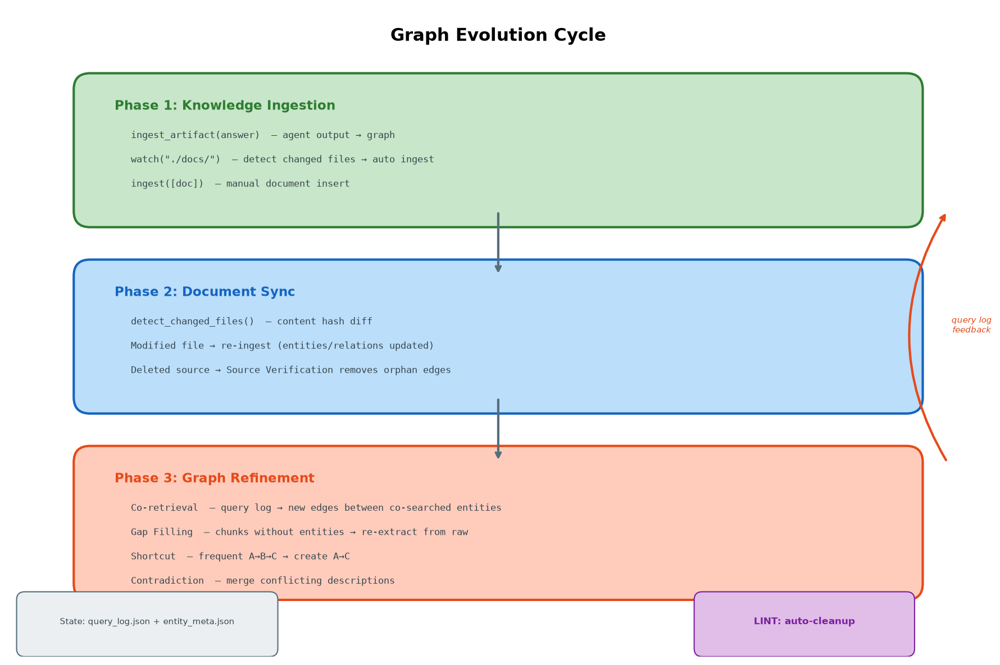

# Evolving LightRAG

LightRAG 위에 **쿼리 로그 기반 그래프 자동 진화 에이전트**를 구축한 프로젝트입니다.

Karpathy의 [LLM Wiki](https://gist.github.com/karpathy/442a6bf555914893e9891c11519de94f)(2026.04)에서 Raw / Wiki / Schema 3계층 구조를 참고하여, LightRAG의 그래프 인프라 위에서 동일한 역할을 수행합니다.

| 계층 | LLM Wiki | Evolving LightRAG |
|---|---|---|
| **Raw** | 원본 문서 (불변) | 원본 청크 + `watch()` 자동 감지 |
| **Wiki** | LLM 유지보수 마크다운 | 그래프 엔티티/릴레이션 + EVOLVE 증분 |
| **Schema** | 구조 규칙 | `WikiGraphConfig` |

| | LightRAG (vanilla) | LLM Wiki v2 | **Evolving LightRAG** |
|---|---|---|---|
| 검색 | 벡터 + 그래프 | 풀컨텍스트 또는 하이브리드 | **벡터 + BM25 + 그래프 + RRF** |
| 지식 업데이트 | 문서 삽입 시에만 | 페이지 재작성 | **쿼리 패턴 + 파일 감시 + 산출물 재삽입** |
| 원본 보존 | 청크 보존 | 합성만 남음 | 청크 보존 (검증 가능) |
| 구조 점검 | 없음 | LLM 전체 스캔 | **그래프 알고리즘 (0 토큰)** |
| 산출물 재삽입 | 없음 | 답변 → 위키 페이지 | **`ingest_artifact()` → 그래프** |

---

## 그래프가 Evolving하는 과정

그래프는 3단계 사이클을 거치며 상태를 기억하고 점진적으로 개선됩니다. 각 단계의 결과는 `query_log.json`과 `entity_metadata.json`에 영속화되어 세션 간에 유지됩니다.



### Phase 1: Knowledge Ingestion — 지식 삽입

에이전트가 생성한 산출물이나 외부 문서가 그래프에 삽입됩니다.

```python
# 1. 에이전트의 분석 결과/답변을 그래프에 재삽입
answer = await rag.aquery("LightRAG 아키텍처 요약")
await agent.ingest_artifact(answer, label="architecture_summary")
# → 답변 텍스트가 청킹 → LLM 엔티티 추출 → 그래프에 새 노드/엣지 추가
# → 다음 쿼리에서 이 지식이 검색됨

# 2. 감시 디렉토리에 새 파일이 추가되면 자동 삽입
result = await agent.watch("./docs/")
# → content hash 비교 → 변경된 파일만 ingest

# 3. 직접 문서 삽입
await agent.ingest(["문서 텍스트..."], file_paths=["doc.md"])
```

`ingest_artifact()`는 LLM Wiki에서 좋은 쿼리 답변이 위키 페이지로 편입되는 것과 동일한 역할입니다. 삽입된 산출물은 일반 문서와 동일한 파이프라인(청킹 → LLM 추출 → 벡터 임베딩 → BM25 인덱싱 → 그래프 저장)을 거칩니다.

### Phase 2: Document Sync — 원본 동기화

원본 문서가 수정/삭제되면 그래프가 자동으로 따라갑니다.

```python
# watch()는 content hash로 변경을 감지
result = await agent.watch("./docs/")
# → 수정된 파일: re-ingest (기존 엔티티에 새 description 병합)
# → 삭제된 파일: source chunk 소멸 → EVOLVE 전략 4(Source Verification)가 감지
```

**변경 감지**: `detect_changed_files()`가 이전 해시와 비교하여 변경된 파일만 `ingest()`에 전달합니다. 전체 재삽입이 아닌 증분 업데이트입니다.

**근거 상실 관계 제거**: EVOLVE 전략 4(Source Verification)가 모든 엣지의 `source_id`를 검사합니다. 해당 청크가 `text_chunks`에서 사라졌으면 근거 상실로 판단하여 엣지를 제거합니다. EVOLVE가 추론으로 만든 엣지(`wikigraph_evolve`)는 원래 source chunk이 없으므로 이 검사에서 제외됩니다.

### Phase 3: Graph Refinement — 그래프 개선

쿼리 로그를 분석하여 그래프 구조를 자동 개선합니다. `ainsert_custom_kg()`를 통해 주입하므로 벡터 DB와 BM25도 자동 갱신됩니다.

| # | 전략 | 동작 | 그래프 변경 |
|---|---|---|---|
| 1 | **Co-retrieval** | 3회+ 공동 검색된 엔티티 쌍 → LLM 관계 추론 | 엣지 **추가** |
| 2 | **Gap Filling** | 청크 검색됨 + 엔티티 없음 → 원본 청크 기반 재추출 | 노드+엣지 **추가** |
| 3 | **Shortcut** | A→B→C 경로 3회+ → A→C 단축 | 엣지 **추가** |
| 4 | **Source Verification** | source chunk 소멸 확인 | 엣지 **제거** |
| 5 | **Contradiction** | `<SEP>` 구분 description 2개+ → LLM 통합 | 노드 **수정** |

추가된 관계는 `weight=0.5`, `source_id="wikigraph_evolve"`로 마킹되어 원본 추출(weight ≥ 1.0)과 구분됩니다. LINT가 미사용 추론 엣지를 자동 정리합니다.

**Gap Filling은 원본 근거 필수**: 청크에 근거가 없으면 "관련 문서 추가 필요" 리포트만 출력하고 그래프를 수정하지 않습니다.

**트리거**: quality < 0.5 (reactive) | N번째 쿼리마다 (proactive, 기본 5) | `agent.evolve()` (수동)

### 상태 영속화

쿼리 로그와 엔티티 메타데이터가 JSON으로 `working_dir/wikigraph_meta/`에 저장됩니다. 세션을 재시작해도 EVOLVE는 이전 쿼리 패턴을 기억하고 이어서 분석합니다.

| 파일 | 내용 |
|---|---|
| `query_log.json` | 쿼리별 검색된 엔티티/관계 목록, quality 점수 |
| `entity_metadata.json` | 엔티티별 access_count, last_accessed |
| `file_hashes.json` | 디렉토리 감시용 content hash |

---

## 하이브리드 검색

LightRAG(vanilla)의 벡터 전용 검색에 **BM25 키워드 검색**을 추가하고 [RRF](https://plg.uwaterloo.ca/~gvcormac/cormacksigir09-rrf.pdf)로 결합합니다.


BM25는 **그래프 노드/엣지의 모든 텍스트 필드**를 인덱싱합니다.


| 대상 | 인덱싱 필드 |
|---|---|
| Chunks | `content` |
| Entities | `entity_name` + `entity_type` + `content` + `description` |
| Relations | `src_id` + `tgt_id` + `keywords` + `content` + `description` |

각 VDB upsert 시점에 `BM25Index.add()`로 즉시 반영 (전체 재빌드 불필요).

---

## 주요 지표

| 지표 | 출처 | 역할 |
|---|---|---|
| **weight** | LightRAG 기본 | 관계 신뢰도. 원본=1.0(누적), 추론=0.5. 검색 순위 + LINT 정리 기준 |
| **quality** | Evolving 추가 | 쿼리 결과 품질 0~1 (휴리스틱). EVOLVE 트리거 |
| **access_count** | Evolving 추가 | 엔티티 검색 빈도. LINT 방치 탐지 + 추론 엣지 정리 |
| **source_id** | LightRAG 기본 | 출처 청크 추적. 원본 vs 추론 구분, 근거 검증 |

---

## LINT — 그래프 점검

그래프 알고리즘으로 구조적 이상을 탐지합니다 (대부분 0 토큰).

| 점검 | 방법 | 자동 수정 |
|---|---|---|
| 고아 노드 | `node_degree() == 0` | 리포트만 |
| 허브 과부하 | `node_degree() > 50` | 리포트만 |
| 중복 엔티티 | 임베딩 유사도 > 0.95 | 리포트만 |
| 방치 엔티티 | access_count < 2 | 리포트만 |
| 모순 탐지 | 다중 description | 리포트만 |
| **추론 엣지 정리** | `wikigraph_evolve` + weight ≤ 0.5 + 미사용 | **자동 제거** |

---

## 에이전트 구조


LangGraph StateGraph 기반. LightRAG 공개 API만 사용하며 내부 코드를 수정하지 않습니다.

---

## 실행 결과

```
INGEST: 2 documents → 20 nodes, 13 edges

QUERY × 5 → 5th query triggers auto EVOLVE:
  + co-retrieval: Hybrid Query Mode → Local Query Mode (4 co-occurrences)
  + shortcut: Hybrid Query Mode → Knowledge Graph (via LightRAG)
  → 10 relationships injected

EVOLVE (manual): + 4 shortcuts

Final: 20 nodes, 27 edges (13 original + 14 auto-generated)
```


---

## 이론적 배경

- **Co-retrieval → Link Prediction**: [NoGE](https://arxiv.org/abs/2104.07396) — co-occurrence 기반 KGC
- **Gap Filling → Extraction Repair**: [Self-Improving RAG](https://ojs.iscram.org/index.php/Proceedings/article/view/154) — 피드백 루프 보강
- **Shortcut → Transitive Closure**: [SMORE](https://arxiv.org/abs/2110.14890) — multi-hop reasoning
- **Graph Evolution**: [Survey on KG Evolution](https://arxiv.org/abs/2310.04835), [Iterative GraphRAG](https://arxiv.org/abs/2509.25530)

---

## 한계와 열린 질문

- **노이즈 누적**: EVOLVE 관계가 쌓이면 검색 노이즈 증가 가능 ([RAG Survey](https://arxiv.org/abs/2506.00054)). weight 마킹 + LINT 정리로 대응하나 장기 효과 미검증.
- **수확 체감**: 반복 3회 이후 추가 이득 급감 ([Iterative GraphRAG](https://arxiv.org/abs/2509.25530)).
- **vanilla LightRAG나 LLM Wiki 대비 실제 이점 미검증**: 엣지 수 증가는 확인했지만 검색 정확도 향상을 정량 비교하지 않음.
- **복잡성 대비 효용**: 에이전트 인프라가 문서를 더 넣는 것보다 나은지 확인 필요.
- **EVOLVE 전략 간 피드백 루프**: 장기 운영 시 예측 불가 그래프 변형 가능.

### TODO

- [ ] vanilla vs Evolving 검색 품질 정량 비교
- [ ] timestamp 기반 confidence decay
- [ ] Human-in-the-loop: EVOLVE 결과 승인/거부
- [ ] 대규모 코퍼스 장기 검증

---

## 사용법

```python
agent = WikiGraphAgent(rag, WikiGraphConfig(auto_evolve_interval=5))

await agent.ingest(["문서"])                   # 문서 삽입
result = await agent.query("질문")            # 검색 + 자동 진화
await agent.watch("./docs/")                 # 디렉토리 감시 + 자동 삽입
await agent.ingest_artifact(text, "label")   # 산출물 재삽입
await agent.evolve()                         # 수동 진화
await agent.lint()                           # 구조 점검
```

---

## References

- [Karpathy's LLM Wiki](https://gist.github.com/karpathy/442a6bf555914893e9891c11519de94f) (2026.04) / [v2](https://gist.github.com/rohitg00/2067ab416f7bbe447c1977edaaa681e2)
- [LightRAG](https://arxiv.org/abs/2410.05779) (HKUDS, 2024)
- [NoGE: Co-occurrence KG Link Prediction](https://arxiv.org/abs/2104.07396) / [SMORE: Multi-hop KGC](https://arxiv.org/abs/2110.14890)
- [On the Evolution of KGs](https://arxiv.org/abs/2310.04835) / [Iterative GraphRAG](https://arxiv.org/abs/2509.25530)
- [Self-Improving RAG for KG](https://ojs.iscram.org/index.php/Proceedings/article/view/154) / [Practical GraphRAG](https://arxiv.org/abs/2507.03226)
