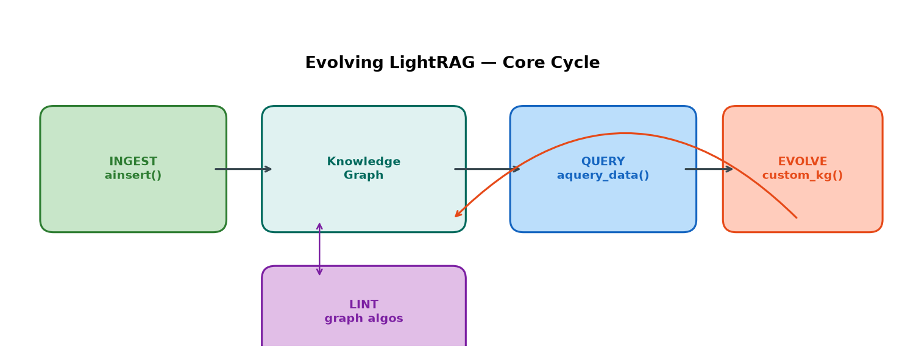
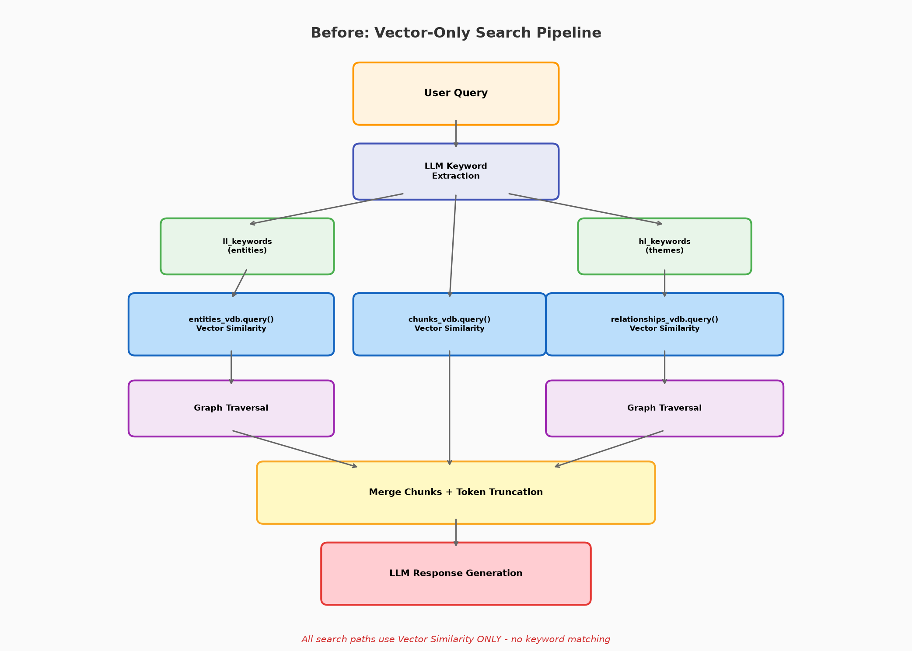
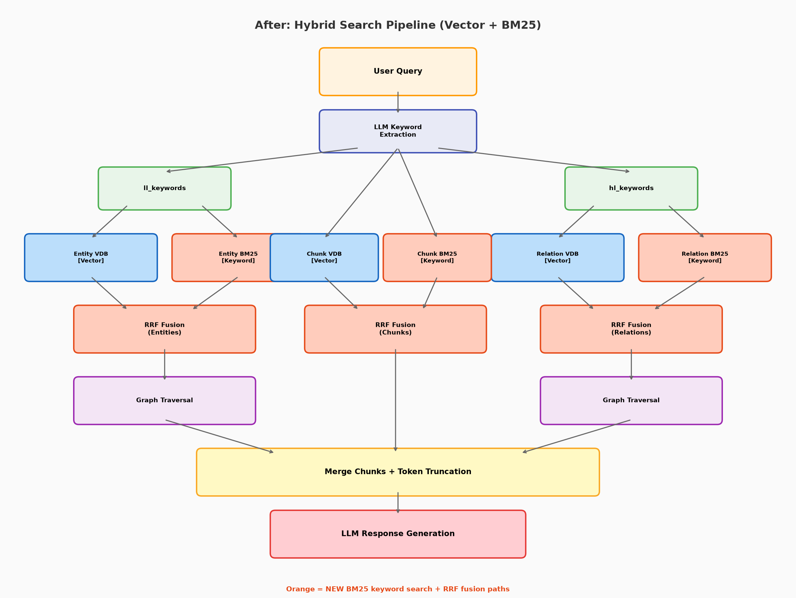
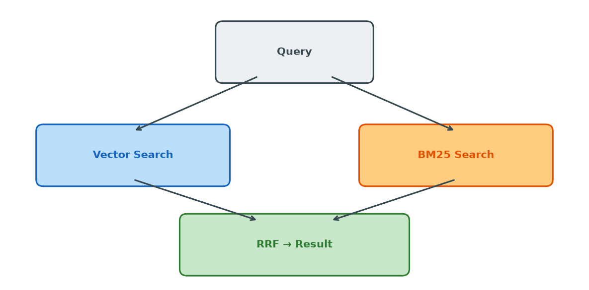
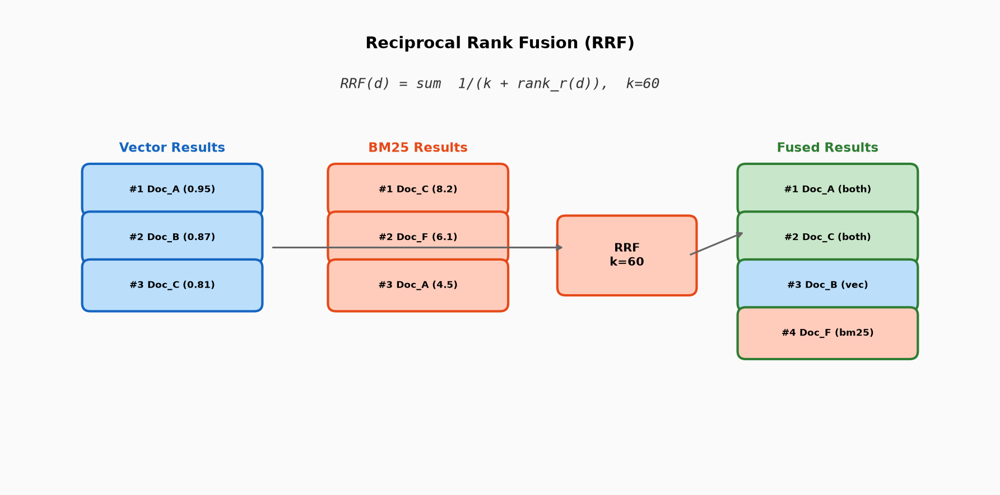
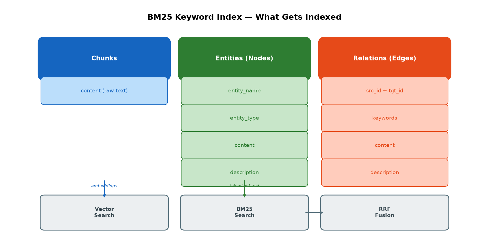
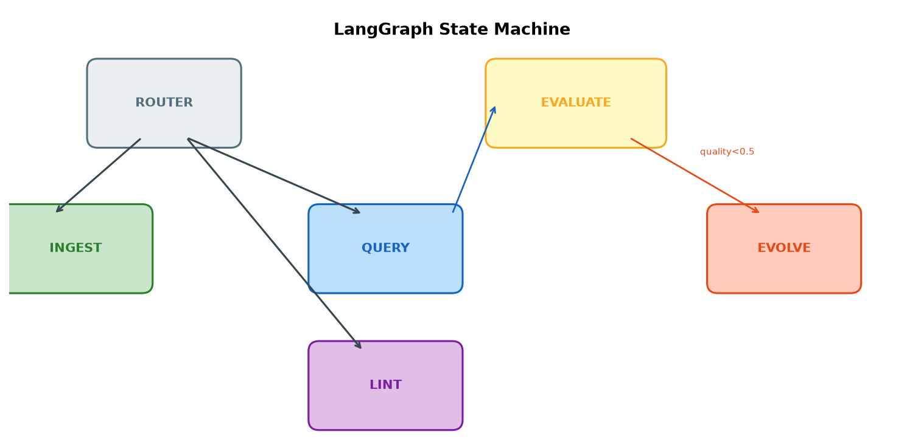
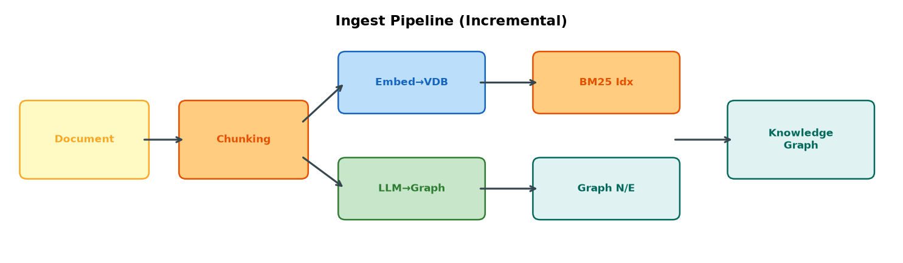
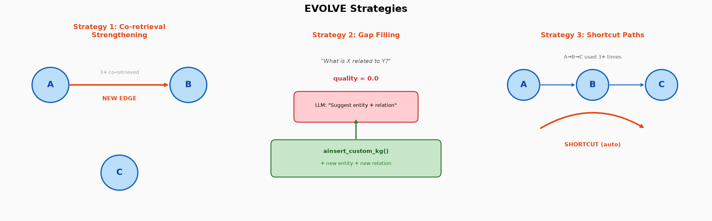
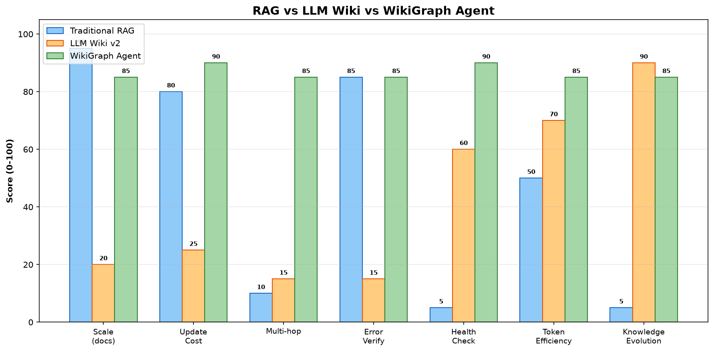

# Evolving LightRAG

LightRAG 위에 **쿼리 로그 기반 그래프 자동 진화 에이전트**를 구축한 프로젝트입니다.

Karpathy의 [LLM Wiki](https://gist.github.com/karpathy/442a6bf555914893e9891c11519de94f)(2026.04) 패턴에서 Raw / Wiki / Schema 3계층 구조와 지식 라이프사이클을 참고하여, LightRAG의 그래프 인프라 위에서 동일한 역할을 수행하는 구조를 설계했습니다.



---

## 3계층 구조

LLM Wiki는 Raw Sources → Wiki → Schema 3계층으로 지식을 관리합니다. Evolving LightRAG에서는 이를 다음과 같이 대응시킵니다.

| 계층 | LLM Wiki에서 | Evolving LightRAG에서 | 구현 |
|---|---|---|---|
| **Raw** | 원본 문서 (불변) | 원본 청크 (불변, 검증용) | `text_chunks` KV 스토리지에 보존 |
| **Wiki** | LLM이 유지보수하는 마크다운 페이지 | 그래프 엔티티 + 릴레이션 | LLM 자동 추출 + EVOLVE 증분 추가 |
| **Schema** | 위키 구조 규칙 (CLAUDE.md 등) | 진화/점검 규칙 | `WikiGraphConfig` (임계값, 주기 설정) |

**Raw 계층**은 `rag.ainsert()` 시 원본 텍스트가 `text_chunks`에 저장되어 이후 검증에 활용됩니다. LLM Wiki에서는 합성 결과만 남아 오류가 전파되지만, 여기서는 원본이 보존됩니다.

**Wiki 계층**은 LLM이 문서에서 추출한 엔티티/릴레이션이 그래프에 저장되고, EVOLVE가 쿼리 패턴을 분석하여 새 릴레이션을 증분 추가합니다. LLM Wiki에서 페이지 10-15개를 통째로 재작성하는 것과 달리, 노드/엣지 단위로 추가되므로 기존 지식이 보존됩니다.

**Schema 계층**은 EVOLVE 트리거 조건(공동 검색 횟수, 품질 임계값), LINT 규칙(허브 차수, 유사도 임계값), 자동 진화 주기 등을 `WikiGraphConfig`로 관리합니다.

---

## 시스템 비교

| | LightRAG (vanilla) | LLM Wiki v2 | **Evolving LightRAG** |
|---|---|---|---|
| 지식 저장 | 그래프 + 벡터 | 마크다운 페이지 | 그래프 + 벡터 + BM25 |
| 검색 | 벡터 유사도 + 그래프 순회 | 풀컨텍스트 로딩 또는 하이브리드 | **벡터 + BM25 + 그래프 + RRF** |
| 지식 업데이트 | 새 문서 삽입 시에만 | LLM이 기존 페이지 읽고 재작성 | **쿼리 패턴 기반 증분 업데이트** |
| 업데이트 비용 | 낮음 (증분) | 높음 (10-15 페이지 재작성) | 낮음 (노드/엣지 단위) |
| 원본 보존 | 청크 보존 | 합성 결과만 남음 | 청크 보존 (검증 가능) |
| 스케일 | 수만 노드 | ~1000페이지 | 수만 노드 |
| 구조 점검 | 없음 | LLM 전체 스캔 | **그래프 알고리즘 (0 토큰)** |
| 다중 홉 추론 | 그래프 순회 가능 | 페이지 기반으로 제한적 | 그래프 순회 + 단축 경로 자동 생성 |
| 키워드 검색 | 없음 | v2에서 추가 | **BM25 점진적 인덱싱** |

---

## 하이브리드 검색

LightRAG(vanilla)는 벡터 코사인 유사도에만 의존합니다. 고유명사나 짧은 쿼리에서 정확한 매칭이 어렵습니다.



Evolving LightRAG는 각 검색 경로(엔티티/관계/청크)에 **BM25 키워드 검색**을 추가하고 RRF로 결합합니다.





### RRF (Reciprocal Rank Fusion)

```
RRF(d) = Σ 1/(k + rank_r(d)),  k=60
```



### BM25 인덱싱 대상

BM25는 청크뿐 아니라 **그래프의 엔티티(노드)와 릴레이션(엣지)의 모든 텍스트 필드**를 인덱싱합니다.



| 대상 | 인덱싱 필드 |
|---|---|
| **Chunks** | `content` (원본 텍스트) |
| **Entities (Nodes)** | `entity_name` + `entity_type` + `content` + `description` |
| **Relations (Edges)** | `src_id` + `tgt_id` + `keywords` + `content` + `description` |

엔티티의 타입 정보("artifact", "organization" 등)나 릴레이션의 키워드("developed by", "uses" 등)도 키워드 검색에 포함되어, 벡터 유사도만으로는 매칭하기 어려운 **구조적 메타데이터 기반 검색**이 가능합니다.

### 점진적 BM25 인덱싱

전체 재빌드 대신 각 VDB upsert 시점에 `BM25Index.add()`를 호출하여 즉시 반영합니다. 디스크 영속화(`save()/load()`)도 지원하여 재시작 시 재빌드가 불필요합니다.

---

## 에이전트 구조

LangGraph StateGraph 기반 에이전트가 LightRAG의 공개 API만 사용하여 동작합니다. LightRAG 내부 코드를 수정하지 않습니다.



---

## INGEST — 문서 삽입과 업데이트

Raw 계층에 해당합니다. 새 문서가 들어오면 LightRAG의 풀 파이프라인을 태워 그래프에 증분 추가합니다.



```python
# 새 문서 삽입
await agent.ingest(["문서 텍스트..."], file_paths=["doc.md"])

# 디렉토리 감시: 변경된 파일만 자동 감지 + 증분 재처리
from wikigraph.sources import detect_changed_files
changed = detect_changed_files("./docs/", "./meta/hashes.json")
if changed:
    await agent.ingest([text for _, text in changed], file_paths=[name for name, _ in changed])
```

내부 동작:
1. `rag.ainsert()` → 청킹 → LLM 엔티티/관계 추출 → 벡터 임베딩 → BM25 인덱싱 → 그래프 저장
2. 기존 엔티티가 새 문서에 재등장하면 description이 **병합**됨 (덮어쓰기가 아님)
3. 삽입 후 대표 구절로 `aquery_data()` 검증 → 추출이 정상인지 확인

`detect_changed_files()`는 content hash를 비교하여 **변경된 파일만** 재처리합니다. 전체 재삽입이 아닌 증분 업데이트입니다.

---

## 주요 지표

EVOLVE와 LINT가 판단에 사용하는 핵심 지표들입니다. weight는 LightRAG에 원래 존재하고, 나머지는 Evolving LightRAG가 추가한 것입니다.

### weight (엣지 가중치) — LightRAG 기본 제공

그래프의 모든 릴레이션에 붙어있는 숫자로, **해당 관계의 확실한 정도**를 나타냅니다. LightRAG가 같은 관계를 여러 문서에서 추출하면 자동으로 합산합니다 (`operate.py`의 `_merge_edges_then_upsert`). 검색 시 `(rank, weight)` 기준으로 내림차순 정렬되어, weight가 높은 관계가 먼저 반환됩니다.

| 출처 | weight | 예시 |
|---|---|---|
| 원본 문서에서 LLM 추출 | **1.0** | "HKUDS developed LightRAG" |
| 같은 관계가 다른 문서에서도 추출 | **누적** (2.0, 3.0...) | 두 문서 모두 같은 관계 언급 |
| EVOLVE가 추론으로 생성 | **0.5** | co-retrieval, shortcut 전략 |

Evolving LightRAG는 이 기존 메커니즘을 활용합니다:
- **검색**: 원본 관계(1.0+)가 추론 관계(0.5)보다 항상 우선
- **LINT 정리**: `weight ≤ 0.5` + `wikigraph_evolve` + 미사용 → 자동 제거 대상
- **Source Verification**: `wikigraph_evolve`가 **아닌** 관계만 source chunk 존재 여부 검사

### quality (쿼리 품질 점수) — Evolving LightRAG 추가

EVALUATE 단계에서 **LLM 호출 없이** 산출하는 0.0~1.0 점수입니다. 쿼리 결과에 포함된 엔티티/관계/청크 수로 계산합니다.

| 결과 | quality | 의미 |
|---|---|---|
| 엔티티 0 + 청크 0 | **0.0** | 그래프에 관련 지식이 전혀 없음 |
| 엔티티 있으나 관계 없음 | **0.3** | 노드는 있지만 연결 정보 부족 |
| 청크만 있고 엔티티 없음 | **0.4** | 원본 텍스트는 있지만 추출이 누락됨 |
| 엔티티 + 관계 + 청크 | **0.5~1.0** | 정상 (수량에 비례) |

quality는 EVOLVE 트리거에 사용됩니다:
- **EVOLVE 트리거**: quality < 0.5이면 EVOLVE 실행 (reactive)
- **Gap Filling**: quality와 별개로, "청크는 검색됐지만 엔티티가 없는" 쿼리를 직접 탐지하여 재추출 (quality 임계값에 의존하지 않음)

### access_count / last_accessed (엔티티 접근 빈도) — Evolving LightRAG 추가

쿼리할 때마다 검색된 엔티티의 `access_count`를 1 증가시키고 `last_accessed`를 갱신합니다. 쿼리 로그와 함께 JSON으로 영속화됩니다.

| 활용 | 조건 |
|---|---|
| LINT 방치 엔티티 탐지 | `access_count < 2`이면서 일정 쿼리 수 동안 미접근 |
| LINT 추론 엣지 자동 정리 | 양쪽 엔티티의 `access_count`가 모두 0 |
| Co-retrieval 분석 | 어떤 엔티티가 함께 검색되는지 쿼리 로그에서 집계 |

### source_id (출처 추적) — LightRAG 기본 제공

모든 엔티티와 릴레이션에 **어떤 청크에서 추출되었는지** `source_id`가 기록됩니다. 여러 청크에서 추출된 경우 `<SEP>`로 구분하여 병합됩니다. EVOLVE가 생성한 관계는 `source_id="wikigraph_evolve"`로 표시됩니다.

| 활용 | 조건 |
|---|---|
| Source Verification (전략 4) | source_id의 청크가 text_chunks에 존재하는지 확인 |
| LINT 추론 엣지 식별 | `wikigraph_evolve` 포함 여부로 원본 vs 추론 구분 |
| 원본 검증 | source_id → 원본 청크 텍스트 참조 가능 |

---

## EVOLVE — 쿼리 패턴 기반 그래프 진화

Wiki 계층에 해당합니다. 쿼리 로그를 분석하여 그래프에 새 릴레이션(또는 엔티티)을 **증분 추가**하거나, 근거가 사라진 관계를 **제거**하거나, 모순된 description을 **수정**합니다. 추가 시 `ainsert_custom_kg()`를 통해 주입하므로 벡터 DB와 BM25 인덱스도 자동으로 갱신됩니다.



### 전략 1: Co-retrieval Strengthening (공동 검색 관계 강화)

**문제**: 엔티티 A와 B가 여러 쿼리에서 반복적으로 함께 검색되지만, 그래프에 직접 연결이 없습니다. 사용자는 이 둘을 관련 있다고 판단하고 있지만 원본 문서에 명시적 관계가 없어서 그래프가 이를 반영하지 못합니다.

**동작**:
1. 쿼리 로그에서 엔티티 쌍별 공동 검색 횟수를 집계합니다
2. 3회 이상 함께 검색된 쌍 중 `graph.has_edge(A, B)` = False인 것을 필터링합니다
3. 양쪽 엔티티의 description을 LLM에 전달하여 관계를 추론합니다
4. 새 릴레이션을 `weight=0.5`, `source_id="wikigraph_evolve"`로 주입합니다

**효과**: 원본 문서에 명시되지 않은 **암묵적 관계**를 사용 패턴에서 발견합니다. 예를 들어 "React"와 "Bun"이 프론트엔드 쿼리에서 항상 함께 나오면, "Bun is the build tool for the React frontend" 같은 관계가 자동 생성됩니다.

**마킹**: `weight=0.5` (원본 추출 = 1.0과 구분), `source_id="wikigraph_evolve"` → 원본 vs 추론 지식 추적 가능. LINT에서 미사용 추론 엣지를 자동 정리할 때 이 마킹을 기준으로 합니다.

### 전략 2: Gap Filling (추출 누락 보강)

**문제**: 쿼리 결과에서 원본 청크는 검색되었지만 그래프 엔티티가 하나도 없는 경우가 있습니다. 원본 텍스트에는 관련 내용이 존재하지만 LLM 추출 과정에서 엔티티/관계가 누락된 것입니다.

**동작**:
1. 쿼리 로그에서 **청크는 검색됐지만 엔티티는 없는** 쿼리를 직접 탐지합니다 (quality 임계값과 무관)
2. 검색된 원본 청크 텍스트를 LLM에 전달하여 엔티티/관계를 **재추출**합니다
3. 청크도 엔티티도 없는 경우 → 리포트만 출력 ("관련 문서 추가 필요")

**원본 근거 필수**: LLM에게 "지어내라"고 하지 않고, **원본 청크에 근거가 있는 경우에만** 그래프를 보강합니다. Raw 계층(원본 데이터)이 항상 근거가 되므로 hallucination을 방지합니다. 원본에도 없는 경우에는 문서를 추가해야 한다는 리포트만 남깁니다.

**효과**: LLM 추출이 놓친 엔티티/관계를 **원본 데이터 기반으로** 복구합니다. 이 전략만이 **새 엔티티 노드**를 추가할 수 있습니다 (나머지 전략은 기존 노드 간 엣지만 추가).

### 전략 3: Shortcut Path (다중 홉 단축 경로)

**문제**: A→B→C 경로가 쿼리에서 반복적으로 사용되지만, A에서 C로 가려면 항상 B를 거쳐야 합니다. 그래프 순회 비용이 발생하고, B가 누락되면 A-C 관계를 찾을 수 없습니다.

**동작**:
1. 쿼리 로그에서 관계 (A,B)와 (B,C)가 3회 이상 함께 검색된 패턴을 탐지합니다
2. A→C 직접 엣지가 없는 경우, A-B와 B-C의 설명을 합성하여 A→C 단축 엣지를 생성합니다
3. `weight=0.5`로 주입합니다

**효과**: 자주 사용되는 다중 홉 경로를 **1홉으로 단축**합니다. "LightRAG → Bun → React" 경로가 자주 쓰이면 "LightRAG → React" 직접 관계가 생겨 다음 쿼리에서 즉시 접근됩니다.

### 전략 4: Source Verification (근거 상실 관계 제거)

**문제**: 문서가 업데이트되거나 삭제되면, 기존에 추출된 릴레이션의 근거(source chunk)가 사라집니다. 그래프에는 남아있지만 더 이상 원본 데이터가 뒷받침하지 않는 관계가 됩니다.

**동작**:
1. 그래프의 모든 엣지를 순회합니다
2. 각 엣지의 `source_id`에 기록된 청크 ID가 `text_chunks`에 실제로 존재하는지 확인합니다
3. 모든 source chunk가 사라진 엣지 → 근거 상실로 판단하여 **제거**합니다
4. EVOLVE가 생성한 엣지(`source_id`에 `wikigraph_evolve` 포함)는 원래 원본 근거가 없으므로 이 검사에서 제외합니다

**효과**: 문서가 업데이트/삭제될 때 그래프가 **자동으로 따라갑니다**. 오래된 정보가 잔류하지 않습니다.

### 전략 5: Contradiction Resolution (모순 description 통합)

**문제**: 같은 엔티티가 여러 문서에서 추출되면 LightRAG가 description을 `<SEP>` 구분자로 병합합니다. 시간이 지나면 서로 충돌하는 설명이 하나의 엔티티에 쌓일 수 있습니다.

**동작**:
1. `<SEP>`로 구분된 description이 2개 이상인 엔티티를 탐지합니다
2. 모든 description을 LLM에 전달하여 **하나의 정확한 설명으로 통합**을 요청합니다
3. 통합된 description으로 그래프 노드를 업데이트합니다

**효과**: 모순되는 정보를 LLM이 판단하여 최신/정확한 내용으로 정리합니다. 예를 들어 "React v17을 사용" + "React v19를 사용"이 병합되어 있으면, LLM이 문맥에서 최신 정보를 선택하여 통합합니다.

### 전략 요약

| 전략 | 동작 | 그래프 변경 |
|---|---|---|
| 1. Co-retrieval | 공동 검색 패턴 → 새 엣지 | **추가** |
| 2. Gap Filling | 청크 근거로 누락 재추출 | **추가** (노드+엣지) |
| 3. Shortcut | 다중 홉 단축 | **추가** |
| 4. Source Verification | 근거 청크 소멸 확인 | **제거** |
| 5. Contradiction | 모순 description 통합 | **수정** |

### 전략의 이론적 배경

전략 1~3은 Knowledge Graph Completion(KGC) 분야의 기존 연구에 기반합니다.

**Co-retrieval → Link Prediction**: 엔티티 공동 출현(co-occurrence)으로 누락된 엣지를 예측하는 것은 KGC의 표준 접근법입니다. [NoGE(Node Co-occurrence based GNN)](https://arxiv.org/abs/2104.07396)는 엔티티-릴레이션 간 공동 출현 빈도를 그래프 임베딩에 통합하여 link prediction 성능을 개선합니다. 우리의 co-retrieval 전략은 이를 쿼리 로그 기반으로 단순화한 것입니다.

**Gap Filling → Extraction Repair**: [Self-Improving RAG for KG Construction](https://ojs.iscram.org/index.php/Proceedings/article/view/154)은 RAG 파이프라인의 추출 누락을 피드백 루프로 보강하는 프레임워크를 제안합니다. 우리의 gap filling은 이를 "청크에 근거가 있는 경우에만 재추출"로 제한하여 hallucination을 방지합니다.

**Shortcut → Transitive Closure**: 그래프에서 A→B→C 경로로부터 A→C 관계를 추론하는 것은 transitive closure 기반 KGC의 기본 원리입니다. [SMORE](https://arxiv.org/abs/2110.14890)는 대규모 KG에서 multi-hop reasoning을 통한 graph completion을, [Practical GraphRAG](https://arxiv.org/abs/2507.03226)는 그래프 순회와 벡터 검색을 RRF로 결합하는 hybrid retrieval을 제안합니다.

### EVOLVE 트리거 조건

| 조건 | 설명 |
|---|---|
| quality < 0.5 (reactive) | EVALUATE에서 결과 품질이 낮으면 즉시 트리거 |
| N번째 쿼리 (proactive) | `auto_evolve_interval` (기본 5) 마다 자동 트리거 |
| 수동 호출 | `agent.evolve()` 로 명시적 트리거 |

---

## LINT — 그래프 구조 점검

Schema 계층에 해당합니다. 그래프 알고리즘으로 구조적 이상을 탐지합니다. LLM Wiki에서 전체 위키를 LLM으로 스캔하는 것과 달리, 대부분의 점검이 **0 토큰**으로 수행됩니다.

### 점검 항목별 동작

**1. 고아 노드 (Orphan Nodes)**

그래프에서 `node_degree() == 0`인 엔티티, 즉 어떤 릴레이션에도 연결되지 않은 노드를 탐지합니다. 리포트만 하고 자동 삭제하지 않습니다 — 새로 추가된 문서에서 아직 관계가 추출되지 않은 정상적인 엔티티일 수 있기 때문입니다.

**2. 허브 과부하 (Hub Overload)**

`node_degree() > threshold` (기본 50)인 엔티티를 탐지합니다. 하나의 엔티티에 관계가 지나치게 집중되면 검색 시 노이즈가 됩니다. 예를 들어 "LightRAG" 노드에 100개의 관계가 몰려 있으면, 어떤 쿼리를 해도 "LightRAG"가 결과에 포함되어 변별력이 떨어집니다. 리포트만 하며, 실제 분리는 수동으로 판단합니다.

**3. 중복 엔티티 (Duplicates)**

모든 엔티티 이름을 임베딩한 뒤, 코사인 유사도 > 0.95인 쌍을 탐지합니다. "BUN"과 "Bun Runtime", "React"와 "React.js" 같이 같은 개념이 다른 이름으로 등록된 경우를 찾습니다. 사전 필터링으로 이름에 공통 토큰이 있는 쌍만 비교하여 O(N^2) 비용을 줄입니다. 리포트만 합니다 — 이름이 유사해도 실제로 다른 개념일 수 있기 때문입니다.

**4. 방치 엔티티 (Stale Entities)**

쿼리 로그에서 `access_count < 2`이면서 일정 쿼리 수(기본 20회) 동안 한 번도 검색되지 않은 엔티티를 탐지합니다. 그래프에 존재하지만 실제 검색에 활용되지 않는 노드입니다. 리포트만 합니다.

**5. 모순 탐지 (Contradictions)**

LightRAG는 같은 엔티티가 여러 문서에 등장하면 description을 `GRAPH_FIELD_SEP` 구분자로 병합합니다. 병합된 description이 2개 이상인 엔티티를 탐지하여 모순 가능성을 보고합니다. 실제 모순 여부는 선택적으로 LLM에 판단을 요청할 수 있습니다.

**6. 추론 엣지 자동 정리 (Stale Evolved Edges)** — 유일한 자동 수정 항목

EVOLVE가 생성한 엣지(`source_id`에 `"wikigraph_evolve"` 포함) 중에서:
- `weight ≤ 0.5` (추론으로 생성된 것), 그리고
- 양쪽 엔티티의 `access_count`가 모두 0 (한 번도 검색에 활용되지 않음)

이 두 조건을 모두 만족하는 엣지를 자동 제거합니다. 원본 문서에서 추출된 관계(`weight ≥ 1.0`)는 절대 자동 삭제되지 않습니다.

---

## 실행 결과

```
INGEST: 2 documents inserted, 2/2 verified
  → Graph: 20 nodes, 13 edges

QUERY × 5:
  "What is LightRAG?"       → 11 entities, 10 relations
  "How does BM25 work?"     → 12 entities,  9 relations
  "What is hybrid search?"  → 15 entities, 17 relations
  "What query modes exist?" →  6 entities,  4 relations
  "What is RRF?"            →  7 entities,  5 relations (5th query → auto EVOLVE)

EVOLVE (auto, 5th query):
  + co-retrieval: Hybrid Query Mode → Local Query Mode (4 co-occurrences)
  + co-retrieval: Global Query Mode → Knowledge Graph (3 co-occurrences)
  + shortcut: Hybrid Query Mode → Knowledge Graph (via LightRAG)
  → 10 relationships injected

EVOLVE (manual):
  + shortcut: RRF → TF-IDF (via BM25)
  + shortcut: BM25 → Vector (via RRF)
  → 4 relationships injected

LINT: 20 entities scanned, no issues found

Final graph: 20 nodes, 27 edges (13 original + 14 auto-generated)
```



---

## 파일 구조

```
harness_pjt/
├── wikigraph/
│   ├── agent.py           # LangGraph StateGraph + WikiGraphAgent API
│   ├── config.py          # Schema 계층: EVOLVE/LINT 임계값
│   ├── state.py           # LangGraph 상태 스키마 (TypedDict)
│   ├── metadata.py        # 쿼리 로그 + 엔티티 메타데이터 영속화
│   ├── sources.py         # Raw 계층: 파일 수집, 변경 감지
│   └── operations/
│       ├── ingest.py      # Raw → Wiki: rag.ainsert() + 검증
│       ├── query.py       # Wiki 검색: rag.aquery_data() + 로깅 + 평가
│       ├── evolve.py      # Wiki 진화: 3가지 전략으로 그래프 증분 개선
│       └── lint.py        # Schema 점검: 5가지 구조 점검 + 자동 정리
├── demo_wikigraph.ipynb
├── demo_hybrid_search.ipynb
└── README.md
```

---

## 사용법

```python
from wikigraph.agent import WikiGraphAgent
from wikigraph.config import WikiGraphConfig

rag = LightRAG(
    working_dir="./my_kb",
    llm_model_func=llm_func,
    embedding_func=embed_func,
    addon_params={"enable_hybrid_search": True},
)
await rag.initialize_storages()

agent = WikiGraphAgent(rag, WikiGraphConfig(auto_evolve_interval=5))

# Raw: 문서 삽입 (증분)
await agent.ingest(["문서 내용..."])

# Wiki: 검색 + 자동 진화
result = await agent.query("질문")

# Wiki: 수동 진화 트리거
await agent.evolve()

# Schema: 구조 점검
await agent.lint()
```

---

## 기술 스택

| 컴포넌트 | 기술 |
|---|---|
| Agent 오케스트레이션 | LangGraph StateGraph |
| 지식 엔진 | LightRAG (Graph + VDB + BM25) |
| 검색 | Vector + BM25 + Graph Traversal + RRF |
| 임베딩 | sentence-transformers/all-MiniLM-L6-v2 |
| LLM | Qwen 35B (원격) |

---

## 그래프 진화의 의미와 한계

### 왜 그래프를 고쳐나가는가

정적인 knowledge graph는 시간이 지날수록 현실과 괴리가 생깁니다. [On the Evolution of Knowledge Graphs (2023)](https://arxiv.org/abs/2310.04835)에 따르면, 실세계 지식은 지속적으로 변하며, 새 엔티티가 등장하고, 기존 지식이 수정되고, 관계가 추가/삭제됩니다. 정적 그래프는 이를 반영하지 못합니다.

LightRAG(vanilla)의 그래프는 문서 삽입 시점에 고정됩니다. 이후 아무리 많이 쿼리해도:
- 자주 함께 필요한 엔티티 사이에 관계가 없으면 **영원히 없습니다**
- 추출이 누락된 엔티티는 **영원히 누락됩니다**
- 문서가 업데이트되어도 기존 관계는 **그대로 남습니다**
- 모순되는 description이 쌓여도 **아무도 정리하지 않습니다**

Evolving LightRAG의 EVOLVE/LINT 사이클은 이 문제를 쿼리 사용 패턴과 원본 데이터 검증을 기반으로 자동 해결합니다.

### 현재 구현의 한계

**노이즈 누적**: EVOLVE가 추가한 관계가 반복적으로 쌓이면 그래프에 노이즈가 증가할 수 있습니다 ([RAG Survey, 2025](https://arxiv.org/abs/2506.00054)). 현재 `weight=0.5` 마킹 + LINT 자동 정리로 대응하지만, 장기 운영 시 효과를 검증할 필요가 있습니다.

**수확 체감**: [Iterative GraphRAG 연구](https://arxiv.org/abs/2509.25530)에 따르면 반복 3회 이후 추가 이득이 급감합니다. `evolve_max_mutations` 제한으로 대응하지만, 최적의 주기와 임계값은 도메인에 따라 튜닝이 필요합니다.

**LLM 추출 정확도**: 엔티티/관계 추출 정확도가 도메인에 따라 [60-85%](https://arxiv.org/abs/2506.00054) 수준입니다. gap filling이 재추출해도 같은 실수를 반복할 수 있습니다.

### LLM Wiki 대비 아직 부족한 점

LLM Wiki가 가진 장점 중 현재 Evolving LightRAG에 반영되지 않은 것들입니다.

| LLM Wiki 장점 | 현재 상태 | 필요한 구현 |
|---|---|---|
| **인간 가독성** — 위키 페이지를 사람이 직접 읽고 검토 가능 | 그래프 노드/엣지는 사람이 읽기 어려움 | 엔티티별 요약 페이지 자동 생성 |
| **QUERY 결과의 지식 편입** — 좋은 답변이 위키 페이지로 저장됨 | 쿼리 로그만 저장, 답변 자체는 그래프에 반영 안 됨 | 고품질 답변을 청크로 재삽입하는 경로 |
| **Confidence Decay** — 시간이 지나면 지식 신뢰도 감소 | access_count만 있고 시간 기반 감쇠 없음 | timestamp 기반 confidence decay |
| **사용자 피드백 반영** — 사람이 위키 내용을 직접 수정/승인 | 완전 자동, 사람 개입 없음 | Human-in-the-loop 승인 단계 |
| **디렉토리 감시 자동화** — 파일 변경 시 자동 ingest | `detect_changed_files()` 함수만 있고 자동 실행 안 됨 | File watcher 기반 자동 INGEST 루프 |

### 열린 질문

현재 구현은 아키텍처 제안과 프로토타입 단계이며, 실제로 vanilla LightRAG나 LLM Wiki 대비 이점이 있는지는 추가 검증이 필요합니다.

- **EVOLVE가 실제로 검색 품질을 개선하는가?** — 현재 구현 결과에서 그래프 엣지 수가 늘어나는 것은 확인했지만, 추가된 관계가 실제 쿼리 정확도를 올리는지는 정량적으로 비교하지 않았습니다. 같은 쿼리셋에 대해 vanilla LightRAG vs Evolving LightRAG의 검색 결과를 비교하는 평가가 필요합니다.
- **복잡성 대비 효용이 있는가?** — LangGraph 에이전트, 쿼리 로그 관리, 5가지 EVOLVE 전략, LINT 등의 추가 복잡성이 vanilla LightRAG에 문서 몇 개 더 넣는 것보다 실질적으로 나은지 확인이 필요합니다. 단순한 시스템이 충분할 수도 있습니다.
- **LLM Wiki가 이미 충분한 규모에서 이 시스템이 필요한가?** — LLM Wiki는 ~1000페이지 이하에서 잘 동작하며, 많은 실제 유스케이스가 이 범위에 들어갑니다. 그래프 기반 진화가 필요한 규모와 도메인이 어디인지 구체적 사례가 필요합니다.
- **EVOLVE 전략 간 상호작용** — co-retrieval이 추가한 관계가 shortcut 탐지에 영향을 주고, 그것이 다시 co-retrieval에 영향을 주는 피드백 루프가 발생할 수 있습니다. 장기 운영 시 예측하지 못한 그래프 변형이 발생할 수 있습니다.

### TODO

- [ ] vanilla LightRAG vs Evolving LightRAG 검색 품질 정량 비교
- [ ] 엔티티별 마크다운 요약 페이지 자동 생성 (인간 가독성 확보)
- [ ] 고품질 쿼리 답변을 그래프에 재삽입하는 경로
- [ ] timestamp 기반 confidence decay (오래된 지식 신뢰도 감소)
- [ ] Human-in-the-loop: EVOLVE 결과를 사용자가 승인/거부
- [ ] File watcher 기반 디렉토리 감시 → 자동 INGEST
- [ ] 대규모 코퍼스(1000+ 문서)에서의 성능/노이즈 장기 검증
- [ ] EVOLVE 전략 간 피드백 루프 안정성 검증

---

## References

**Architecture**
- [Karpathy's LLM Wiki](https://gist.github.com/karpathy/442a6bf555914893e9891c11519de94f) (2026.04)
- [LLM Wiki v2](https://gist.github.com/rohitg00/2067ab416f7bbe447c1977edaaa681e2)
- [LightRAG](https://arxiv.org/abs/2410.05779) (HKUDS, 2024)
- [What LLM Wiki Is Missing](https://dev.to/penfieldlabs/what-karpathys-llm-wiki-is-missing-and-how-to-fix-it-1988)
- [RAG vs Agent Memory vs LLM Wiki](https://dev.to/vishalmysore/rag-vs-agent-memory-vs-llm-wiki-a-practical-comparison-1oo6)

**Knowledge Graph Evolution**
- [On the Evolution of Knowledge Graphs: A Survey](https://arxiv.org/abs/2310.04835) — KG가 왜 업데이트되어야 하는가
- [Iterative Retrieval in GraphRAG: Diminishing Returns](https://arxiv.org/abs/2509.25530) — 반복 검색의 수확 체감
- [RAG Comprehensive Survey: Noise and Robustness](https://arxiv.org/abs/2506.00054) — 노이즈 누적 위험

**EVOLVE Strategy Foundations**
- [NoGE: Node Co-occurrence based GNN for KG Link Prediction](https://arxiv.org/abs/2104.07396) — co-occurrence 기반 link prediction
- [SMORE: KG Completion and Multi-hop Reasoning](https://arxiv.org/abs/2110.14890) — transitive closure 기반 multi-hop
- [Practical GraphRAG: Hybrid Retrieval at Scale](https://arxiv.org/abs/2507.03226) — graph + vector RRF fusion
- [Self-Improving RAG for KG Construction](https://ojs.iscram.org/index.php/Proceedings/article/view/154) — extraction gap repair
- [Calibrated Fusion for Multi-Hop QA](https://arxiv.org/abs/2603.28886) — RRF in graph-vector retrieval
