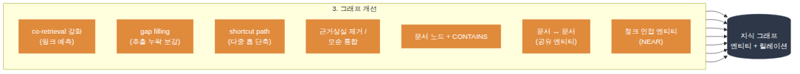

# Evolving LightRAG

LightRAG 위에 **쿼리 로그·리트리브 결과·코퍼스 메타데이터를 근거로 스스로 그래프를 넓혀가는 에이전트**를 얹은 프로젝트입니다. Karpathy의 [LLM Wiki](https://gist.github.com/karpathy/442a6bf555914893e9891c11519de94f) 같은 "지식이 계속 정비되는 시스템"들에서 영감을 받았지만, 위키 페이지를 유지보수하는 게 아니라 **LightRAG의 그래프 자체를 질문이 쌓일 때마다 계속 진화시키는 에이전트 RAG**를 만든 것이라고 보면 됩니다.

세부 전략·지표·이론적 배경은 이 문서에서 다루지 않습니다 — **[ARCHITECTURE.md](ARCHITECTURE.md)** 에 정리되어 있습니다.


---

## 전체 흐름: 세 단계

에이전트가 하는 일은 크게 세 단계로 나뉩니다. 하나의 쿼리가 들어오면 1 → 2 → 3 순서로 이어지되, **2·3은 백그라운드에서 돌아 사용자 응답을 지연시키지 않습니다.**

1. **쿼리분석 및 전략선택, 유저응답** — 질문을 검색에 최적화된 형태로 분석하고, 곧바로 사용자에게 답을 리턴합니다.
2. **로깅 및 로그분석** — 답변과 별개로 서브쿼리별 리트리브 결과를 채점하고, 쿼리 로그와 엔티티 메타데이터에 쌓습니다.
3. **그래프 개선** — 쌓인 로그와 코퍼스 메타데이터를 근거로 그래프에 엔티티/관계를 추가하거나 정리합니다.


---

## 1. 쿼리분석 및 전략선택, 유저응답

- **ANALYZE**: 질문을 검색에 최적화된 형태로 재작성하고, 하나의 질문이 여러 정보 요구를 담고 있으면 서브쿼리로 분해합니다.
- **전략 선택**: ANALYZE의 출력을 곧바로 응답에 쓸지, 백그라운드 큐로 넘겨 로깅·그래프 개선까지 이어갈지 여기서 갈립니다. 실제로는 두 경로가 동시에 진행됩니다 — 응답을 막지 않습니다.
- **RESPOND (유저응답)**: 최적화된 쿼리로 즉시 검색해 사용자에게 답을 리턴합니다. 로깅이나 그래프 개선을 기다리지 않습니다.

구현은 [`wikigraph/operations/analyze.py`](wikigraph/operations/analyze.py)(ANALYZE)와 [`wikigraph/operations/query.py`](wikigraph/operations/query.py)(RESPOND)를 참고하세요.

---

## 2. 로깅 및 로그분석

백그라운드 큐에 올라간 쿼리는 서브쿼리별로 다시 리트리브되고, 그 결과가 쿼리 로그와 엔티티 메타데이터로 쌓입니다. 이 단계에서 만들어진 로그가 다음 단계(그래프 개선)의 유일한 입력입니다.

- **RETRIEVE**: 서브쿼리마다 독립적으로 리트리브해서 "이 정보 요구에 대해 무엇이 검색됐는지"를 정확히 남깁니다.
- **EVALUATE**: 리트리브 결과마다 0.0~1.0 quality 점수를 매깁니다. LLM 호출 없이 순수 규칙 기반입니다.
- **로그/메타데이터 축적**: 쿼리 로그(`query_log`, 무엇이 자주 같이 검색됐는지)와 엔티티 메타데이터(`access_count`, `last_accessed`)를 갱신합니다.

이렇게 쌓인 로그를 다시 훑어 패턴(co-retrieval 빈도, 반복되는 멀티홉 경로, 추출 누락)을 뽑아내는 것도 이 단계의 역할이며, 그 결과가 3단계 그래프 개선의 트리거·근거가 됩니다.

구현은 [`wikigraph/operations/query.py`](wikigraph/operations/query.py)(RETRIEVE/EVALUATE)와 [`wikigraph/metadata.py`](wikigraph/metadata.py)(로그·메타데이터 영속화)를 참고하세요.

---

## 3. 그래프 개선

2단계에서 쌓인 로그·리트리브 결과, 그리고 LightRAG가 원래 갖고 있던 코퍼스 메타데이터(`full_doc_id`, `chunk_order_index`)를 근거로 그래프를 **확장**(새 엔티티/관계 추가)하거나 **정리**(설명 통합, 근거 상실 관계 제거)합니다. 근거가 쿼리 로그 쪽이든 코퍼스 메타데이터 쪽이든 결국 하나의 카테고리입니다 — 모두 "그래프 개선"이라는 같은 백그라운드 파이프라인에서 함께 실행됩니다.



- **co-retrieval 강화**: 자주 함께 검색되는데 연결이 없는 엔티티를 링크 예측 방식으로 연결
- **gap filling**: 리트리브는 됐지만 추출이 누락된 청크에서 엔티티/관계를 재추출
- **shortcut path**: 반복되는 A→B→C 다중 홉 경로를 A→C로 단축
- **근거 상실 제거 / 모순 통합**: 문서가 사라지면 근거를 잃은 관계를 지우고, 여러 출처의 모순된 설명을 하나로 통합
- **문서 노드 + CONTAINS**: 문서를 그래프 노드로 만들고, 그 문서에서 추출된 엔티티를 연결
- **문서 ↔ 문서**: 엔티티를 공유하는 문서끼리 연결
- **청크 인접 엔티티**: 같은 문서의 인접한 청크에서 나온 엔티티끼리 연결

두 티어로 나뉩니다: **매 쿼리마다** 가볍게 도는 tier 1(light)과, **N번째 쿼리마다**(기본 50) 누적된 로그 전체를 다시 훑어 더 폭넓게 개선하는 tier 2(batch)입니다. 그래프 전체를 스캔해야 하는 무거운 정리 작업(근거 상실 관계 제거, 모순 통합)과 문서/청크 구조 마이닝은 tier 2에 묶여서 함께 돕니다.

여기서 만들어진 변화는 **이번 답변이 아니라 다음 쿼리부터** 반영됩니다.

구현은 [`wikigraph/operations/evolve.py`](wikigraph/operations/evolve.py)와 [`wikigraph/operations/structural.py`](wikigraph/operations/structural.py)를 참고하세요.

전체 파이프라인은 [`wikigraph/agent.py`](wikigraph/agent.py)의 `WikiGraphAgent.query()`가 담당합니다. LangGraph `StateGraph`는 이 중 진짜로 여러 단계가 이어지는 백그라운드 파이프라인(`RETRIEVE → EVALUATE → EVOLVE(light) → EVOLVE(batch) → STRUCTURAL`)에만 쓰이고, ANALYZE와 RESPOND는 단일 호출이라 직접 함수로 호출합니다.

---

## 사용법

```python
from wikigraph.agent import WikiGraphAgent
from wikigraph.config import WikiGraphConfig

rag = LightRAG(working_dir="./my_kb", llm_model_func=llm_func, embedding_func=embed_func)
await rag.initialize_storages()

agent = WikiGraphAgent(rag, WikiGraphConfig(batch_evolve_interval=50), llm_func=llm_func)

# 문서 삽입
await agent.ingest(["문서 내용..."])

# 질문: 즉시 답을 받고, 로깅·그래프 개선은 백그라운드 큐에 올라감
result = await agent.query("질문")
print(result["answer"])

# 백그라운드 작업이 끝나길 명시적으로 기다리고 싶을 때 (테스트/종료 시)
await agent.flush()

# 수동으로 그래프 개선 파이프라인 전체를 즉시 실행
await agent.evolve()

# 구조 점검 (린팅)
await agent.lint()
```

---

## 파일 구조

```
harness_pjt/
├── wikigraph/
│   ├── agent.py              # WikiGraphAgent: ANALYZE → fork(RESPOND / 백그라운드 로깅·그래프개선 큐)
│   ├── config.py              # 단계별 임계값
│   ├── state.py               # LangGraph 상태 스키마 (TypedDict)
│   ├── metadata.py            # 쿼리 로그 + 엔티티 메타데이터 영속화 (2. 로깅 및 로그분석)
│   ├── sources.py              # 파일 수집, 변경 감지
│   └── operations/
│       ├── analyze.py         # 1. 쿼리 재작성 + 분해
│       ├── ingest.py          # 문서 삽입 + 검증
│       ├── query.py           # 1. RESPOND(전경) + 2. RETRIEVE/EVALUATE(백그라운드)
│       ├── evolve.py           # 3. 그래프 개선 — 지식그래프 쪽: tier1(매 쿼리) + tier2(배치)
│       ├── structural.py       # 3. 그래프 개선 — 구조 관계 쪽: 문서-문서, 청크-청크
│       └── lint.py             # 린팅: 구조 점검 + 제한적 자동 정리
├── diagrams/
│   └── *.mmd                  # 아래 다이어그램들의 mermaid 소스
├── scripts/
│   └── render_diagrams.py     # diagrams/*.mmd → images/*.png (mermaid-cli)
└── tests/
    └── test_wikigraph.py
```

---

## 한계와 열린 질문

현재 구현은 아키텍처 제안과 프로토타입 단계입니다. vanilla LightRAG 대비 검색 품질이 실제로 개선되는지, 구조 관계가 멀티홉 질의에 실질적으로 도움이 되는지는 정량적으로 검증되지 않았습니다. 자세한 위험 분석과 TODO는 [ARCHITECTURE.md의 한계](ARCHITECTURE.md#한계)를 참고하세요.

---

## References

- [Karpathy's LLM Wiki](https://gist.github.com/karpathy/442a6bf555914893e9891c11519de94f) (2026.04)
- [LightRAG](https://arxiv.org/abs/2410.05779) (HKUDS, 2024)
- [On the Evolution of Knowledge Graphs: A Survey](https://arxiv.org/abs/2310.04835)

전략별 근거 논문은 [ARCHITECTURE.md의 References](ARCHITECTURE.md#references)에 정리되어 있습니다.
