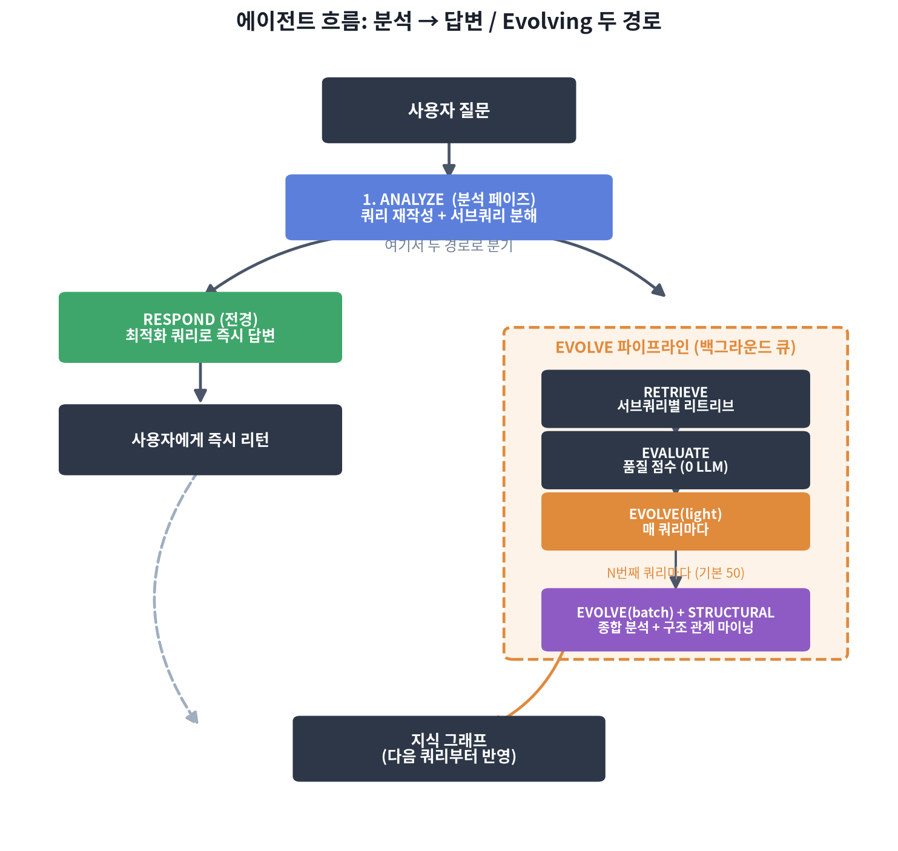
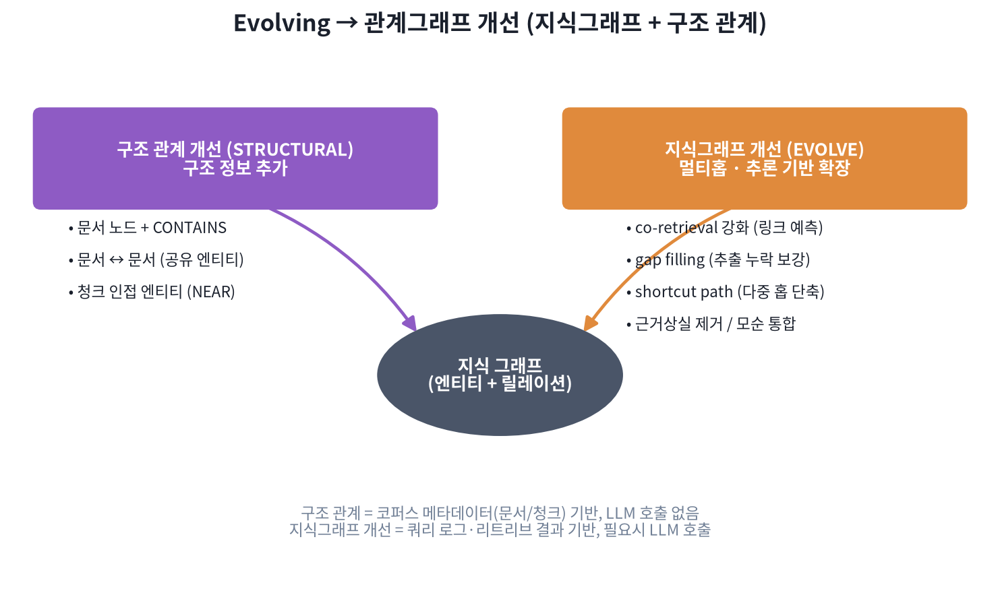

# Evolving LightRAG

LightRAG 위에 **쿼리 로그·리트리브 결과·코퍼스 메타데이터를 근거로 스스로 그래프를 넓혀가는 에이전트**를 얹은 프로젝트입니다. Karpathy의 [LLM Wiki](https://gist.github.com/karpathy/442a6bf555914893e9891c11519de94f) 같은 "지식이 계속 정비되는 시스템"들에서 영감을 받았지만, 위키 페이지를 유지보수하는 게 아니라 **LightRAG의 그래프 자체를 질문이 쌓일 때마다 계속 진화시키는 에이전트 RAG**를 만든 것이라고 보면 됩니다.

세부 전략·지표·이론적 배경은 이 문서에서 다루지 않습니다 — **[ARCHITECTURE.md](ARCHITECTURE.md)** 에 정리되어 있습니다.


---

## 그래프는 무엇을 근거로 진화하는가

그래프 진화는 매번 새로 추론하는 게 아니라, 이미 쌓인 세 가지 근거를 조합합니다:

- **쿼리 분석 결과** — 이번 질문이 어떤 정보 요구로 쪼개졌는지 (`ANALYZE`의 출력)
- **리트리브 결과** — 그 정보 요구마다 실제로 무엇이 검색됐는지 (엔티티/관계/청크)
- **축적된 로그와 메타데이터** — 지금까지의 쿼리 로그(무엇이 자주 같이 검색됐는지), 그리고 LightRAG가 원래 갖고 있던 코퍼스 메타데이터(어느 문서·어느 청크에서 왔는지)

이 세 가지를 근거로 엔티티/관계를 **확장**(새로 추가)하거나 **개선**(설명 통합, 근거 상실 정리)합니다. 어떤 근거를 얼마나 쓰는지는 두 기둥이 다릅니다 — 지식그래프 개선은 쿼리 로그·리트리브 결과 위주, 구조 관계 개선은 코퍼스 메타데이터 위주입니다. 자세한 건 아래 [관계그래프 개선](#evolving--관계그래프-개선) 절에서 다룹니다.

---

## 에이전트 흐름: 분석 페이즈 → 답변 / Evolving 페이즈

크게 두 페이즈로 나뉩니다.

1. **쿼리 분석 페이즈 (ANALYZE)** — 질문을 검색에 최적화된 형태로 재작성하고, 하나의 질문이 여러 정보 요구를 담고 있으면 서브쿼리로 분해합니다.
2. **답변 및 Evolving 페이즈** — 여기서 두 경로로 갈라집니다.
   - **답변 (RESPOND)**: 분석 페이즈가 만든 최적화 쿼리로 바로 검색해 사용자에게 **즉시** 답을 리턴합니다. 그래프 개선을 기다리지 않습니다.
   - **Evolving (백그라운드)**: 답변을 리턴하는 것과 동시에 큐에 올라가, 별도 워커가 순서대로 처리합니다. 서브쿼리별로 리트리브하고, 품질을 평가하고, 그 결과로 그래프를 개선합니다. 여기서 만들어진 변화는 **이번 답변이 아니라 다음 쿼리부터** 반영됩니다.



Evolving은 두 티어로 나뉩니다: **매 쿼리마다** 가볍게 도는 tier 1과, **N번째 쿼리마다**(기본 50) 누적된 로그 전체를 다시 훑어 더 폭넓게 개선하는 tier 2입니다. tier 2에서는 그래프 전체를 스캔해야 하는 무거운 정리 작업(근거 상실 관계 제거, 모순 통합)과 구조 관계 마이닝도 함께 실행됩니다.

구현은 [`wikigraph/agent.py`](wikigraph/agent.py)의 `WikiGraphAgent.query()`가 담당합니다. LangGraph `StateGraph`는 이 중 진짜로 여러 단계가 이어지는 Evolving 파이프라인(`RETRIEVE → EVALUATE → EVOLVE(light) → EVOLVE(batch) → STRUCTURAL`)에만 쓰이고, ANALYZE와 RESPOND는 단일 호출이라 직접 함수로 호출합니다.

---

## Evolving → 관계그래프 개선

Evolving 페이즈가 백그라운드에서 실제로 하는 일은 결국 하나입니다: **관계그래프를 개선하는 것.** 이건 두 축으로 나뉩니다.



### 구조 정보 추가 (구조 관계 개선, STRUCTURAL)

LightRAG의 엔티티/관계 추출은 텍스트 안의 *의미적* 관계만 잡아내고, 문서와 문서, 청크와 청크 사이의 *구조적* 관계는 전혀 드러내지 못합니다. STRUCTURAL은 LightRAG가 이미 갖고 있는 코퍼스 메타데이터(`full_doc_id`, `chunk_order_index`)만으로 — LLM 호출 없이 — 이 구조를 그래프에 명시합니다:

- 문서를 그래프 노드로 만들고, 그 문서에서 추출된 엔티티를 `CONTAINS`로 연결
- 엔티티를 공유하는 문서끼리 연결 (문서 ↔ 문서)
- 같은 문서의 인접한 청크에서 나온 엔티티끼리 연결 (청크 인접)

### 지식그래프 기반 멀티홉 등 (지식그래프 개선, EVOLVE)

쿼리 로그와 원본 청크를 근거로 기존 지식그래프 완성(KGC) 전략을 적용합니다:

- **co-retrieval 강화**: 자주 함께 검색되는데 연결이 없는 엔티티를 링크 예측 방식으로 연결
- **gap filling**: 리트리브는 됐지만 추출이 누락된 청크에서 엔티티/관계를 재추출
- **shortcut path**: 반복되는 A→B→C 다중 홉 경로를 A→C로 단축
- **근거 상실 제거 / 모순 통합**: 문서가 사라지면 근거를 잃은 관계를 지우고, 여러 출처의 모순된 설명을 하나로 통합

두 축 모두 매 쿼리(tier 1)와 배치(tier 2) 주기로 실행되지만, 실제로는 STRUCTURAL과 tier 2 지식그래프 개선이 같은 배치 사이클에 묶여서 함께 도는 구조입니다.

---

## 사용법

```python
from wikigraph.agent import WikiGraphAgent
from wikigraph.config import WikiGraphConfig

rag = LightRAG(working_dir="./my_kb", llm_model_func=llm_func, embedding_func=embed_func)
await rag.initialize_storages()

agent = WikiGraphAgent(rag, WikiGraphConfig(batch_evolve_interval=50), llm_func=llm_func)

# 문서 삽입
await agent.ingest(["문서 내용..."])

# 질문: 즉시 답을 받고, 그래프 개선은 백그라운드 큐에 올라감
result = await agent.query("질문")
print(result["answer"])

# 백그라운드 작업이 끝나길 명시적으로 기다리고 싶을 때 (테스트/종료 시)
await agent.flush()

# 수동으로 Evolving 파이프라인 전체를 즉시 실행
await agent.evolve()

# 구조 점검 (린팅)
await agent.lint()
```

---

## 파일 구조

```
harness_pjt/
├── wikigraph/
│   ├── agent.py              # WikiGraphAgent: ANALYZE → fork(RESPOND / 백그라운드 EVOLVE 큐)
│   ├── config.py              # 네 기둥별 임계값
│   ├── state.py               # LangGraph 상태 스키마 (TypedDict)
│   ├── metadata.py            # 쿼리 로그 + 엔티티 메타데이터 영속화
│   ├── sources.py              # 파일 수집, 변경 감지
│   └── operations/
│       ├── analyze.py         # 쿼리 개선: 재작성 + 분해
│       ├── ingest.py          # 문서 삽입 + 검증
│       ├── query.py           # RESPOND(전경) + RETRIEVE/EVALUATE(백그라운드)
│       ├── evolve.py           # 지식그래프 개선: tier1(매 쿼리) + tier2(배치)
│       ├── structural.py       # 구조 관계 개선: 문서-문서, 청크-청크
│       └── lint.py             # 린팅: 구조 점검 + 제한적 자동 정리
├── scripts/
│   └── render_diagrams.py     # 이 문서의 다이어그램 재생성 스크립트
└── tests/
    └── test_wikigraph.py
```

---

## 한계와 열린 질문

현재 구현은 아키텍처 제안과 프로토타입 단계입니다. vanilla LightRAG 대비 검색 품질이 실제로 개선되는지, 구조 관계가 멀티홉 질의에 실질적으로 도움이 되는지는 정량적으로 검증되지 않았습니다. 자세한 위험 분석과 TODO는 [ARCHITECTURE.md의 한계](ARCHITECTURE.md#한계)를 참고하세요.

---

## References

- [Karpathy's LLM Wiki](https://gist.github.com/karpathy/442a6bf555914893e9891c11519de94f) (2026.04)
- [LightRAG](https://arxiv.org/abs/2410.05779) (HKUDS, 2024)
- [On the Evolution of Knowledge Graphs: A Survey](https://arxiv.org/abs/2310.04835)

전략별 근거 논문은 [ARCHITECTURE.md의 References](ARCHITECTURE.md#references)에 정리되어 있습니다.
