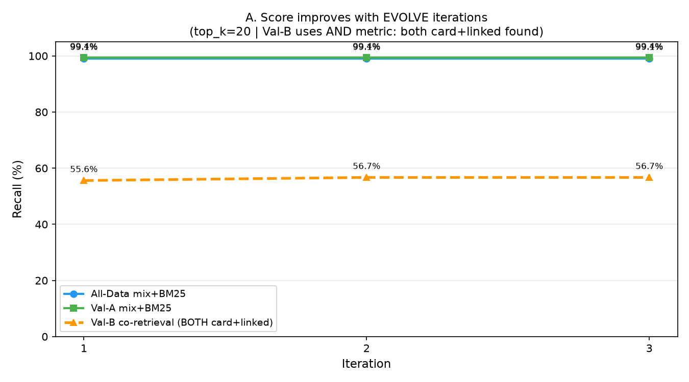
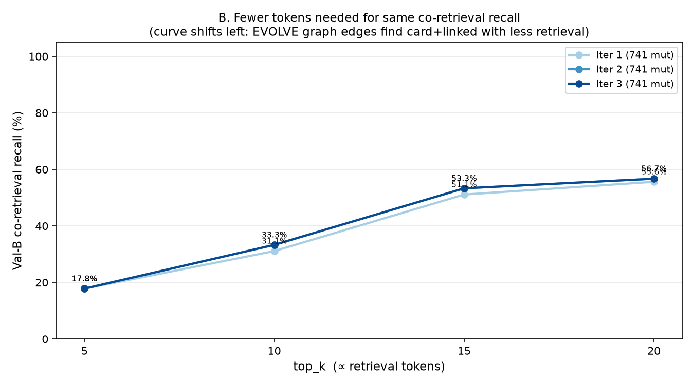

# Scenario 2 — Evolving RAG Benchmark (ver1)

Generated: 2026-07-06 16:44:32  |  Iterations: 3

## Objective
Show that repeated EVOLVE cycles improve RAG quality:
- **A.** Val-B co-retrieval@20 (AND: both card+linked found) increases per iteration
- **B.** Smaller top_k achieves the same co-retrieval recall (token efficiency)

**Why AND for Val-B?** The original benchmark (shs-poc-ragflow) uses co_hit=card AND linked.
EVOLVE adds co-retrieval graph edges between validation cards and their linked docs,
so the graph traversal finds both at lower top_k over time.

## Graphs

## Iteration Results

| Iter | Mutations | All@20 | ValA@20 | ValB co_hit@20 | ValB co_hit@10 | ValB co_hit@5 |
|------|-----------|--------|---------|----------------|----------------|---------------|
| 1 | 741 | 99.1% | 99.4% | 55.6% | 31.1% | 17.8% |
| 2 | 741 | 99.1% | 99.4% | 56.7% | 33.3% | 17.8% |
| 3 | 741 | 99.1% | 99.4% | 56.7% | 33.3% | 17.8% |

## Summary
- Total EVOLVE mutations applied: **2223**
- Val-B co-retrieval@20: **55.6% → 56.7% (+1.1%)**