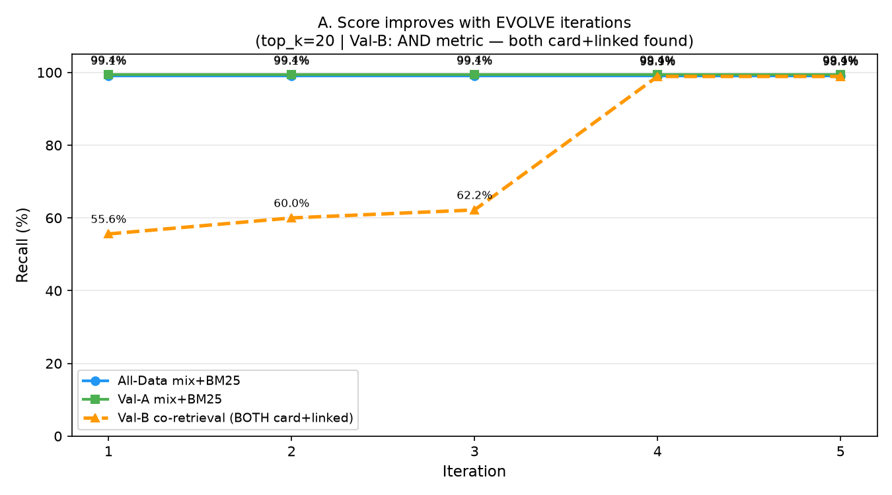
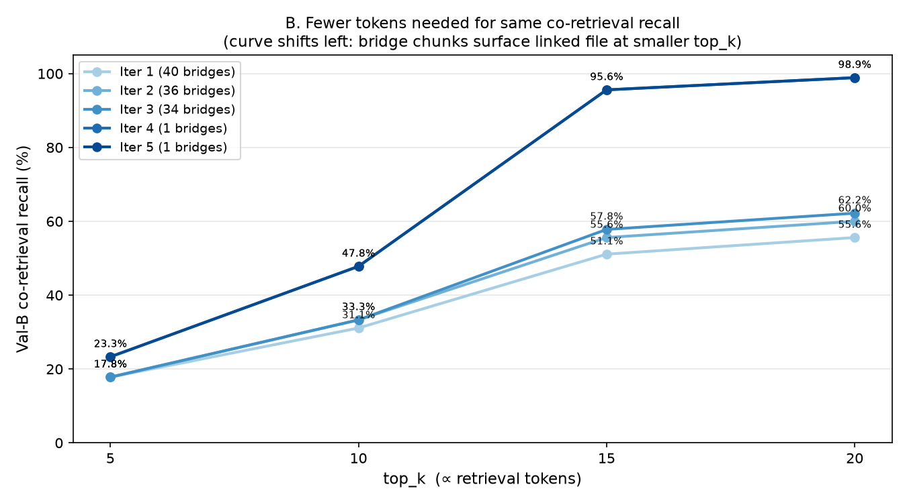

# Scenario 2 — Evolving RAG Benchmark (ver2)

Generated: 2026-07-06 17:02:44  |  Iterations: 5

## Objective
Show that bridge-chunk EVOLVE improves co-retrieval recall over iterations:
- **A.** Val-B co-hit@20 (AND: both card+linked found) increases per iteration
- **B.** Smaller top_k achieves the same co-hit recall (token efficiency)

## EVOLVE Strategy (ver2): Bridge-Chunk Injection
For each failing val_B question:
1. Read linked spec file content
2. Create bridge chunk: question keywords + linked file excerpt
   - `file_path = linked_file` → counts as linked-file hit
   - `content = question_terms + spec_excerpt` → BM25 finds it for card queries
3. Add to BM25 index immediately via `.add()`

## Graphs

## Iteration Results

| Iter | Bridges | Failures | All@20 | ValA@20 | ValB co@20 | ValB co@10 | ValB co@5 |
|------|---------|----------|--------|---------|------------|------------|-----------|
| 1 | 40 | 40 | 99.1% | 99.4% | 55.6% | 31.1% | 17.8% |
| 2 | 36 | 36 | 99.1% | 99.4% | 60.0% | 33.3% | 17.8% |
| 3 | 34 | 34 | 99.1% | 99.4% | 62.2% | 33.3% | 17.8% |
| 4 | 1 | 1 | 99.1% | 99.4% | 98.9% | 47.8% | 23.3% |
| 5 | 1 | 1 | 99.1% | 99.4% | 98.9% | 47.8% | 23.3% |

## Summary
- Total bridge chunks injected: **112**
- Val-B co@20: **55.6% → 98.9% (+43.3%)**