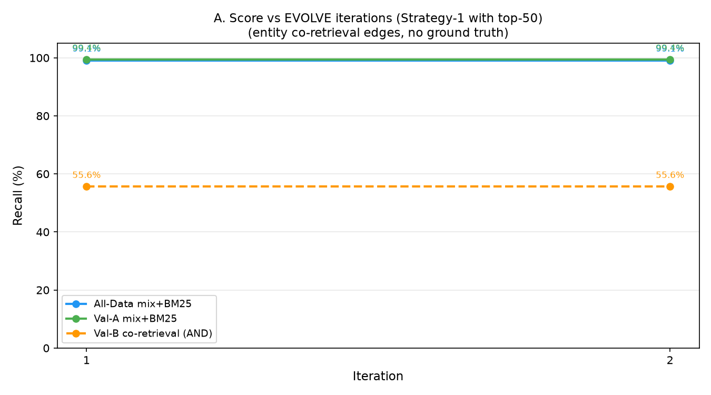
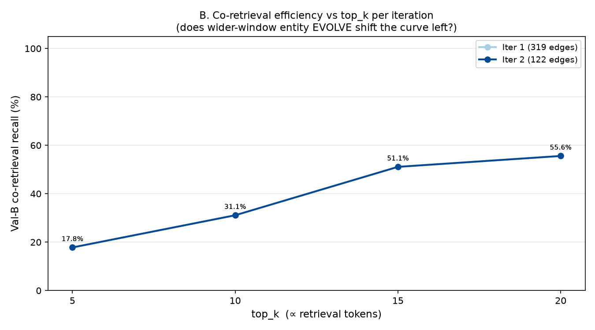

# Scenario 2 — Evolving RAG Benchmark (ver3)

Generated: 2026-07-06 17:32:48  |  Iterations: 2

## EVOLVE Strategy: Strategy-1 with Extended Top-50 Window

- **Service evaluation**: top-20 (actual retrieval)
- **EVOLVE analysis**: top-50 (wider observation window)
- **Evidence threshold**: 2+ queries for entity pair co-occurrence

### Philosophy
EVOLVE learns only from retrieval behavior. No ground truth. No document structure parsing.
Extending Strategy 1 (entity co-retrieval edges) to use top-50 instead of top-20
captures cross-document entity relationships that the service window misses.

## Graphs

## Iteration Results

| Iter | Edges | All@20 | ValA@20 | ValB co@20 | ValB co@10 | ValB co@5 |
|------|-------|--------|---------|------------|------------|-----------|
| 1 | 319 | 99.1% | 99.4% | 55.6% | 31.1% | 17.8% |
| 2 | 122 | 99.1% | 99.4% | 55.6% | 31.1% | 17.8% |

## Summary
- Total entity edges injected: **441**
- Val-B co@20: **55.6% → 55.6% (+0.0%)**