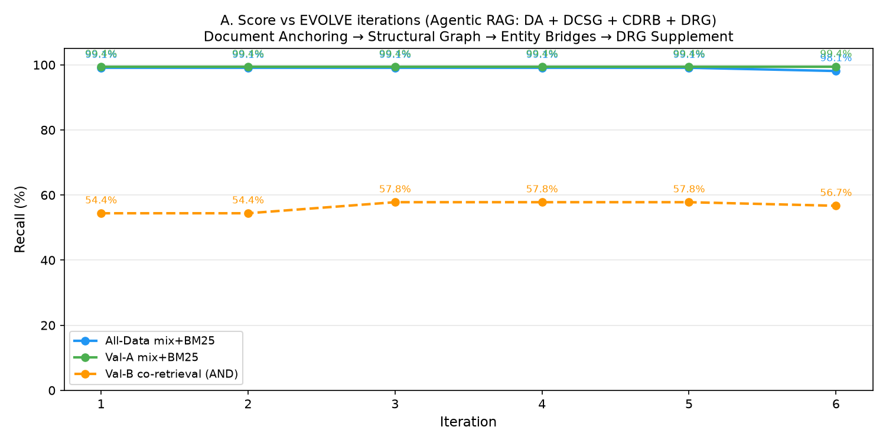
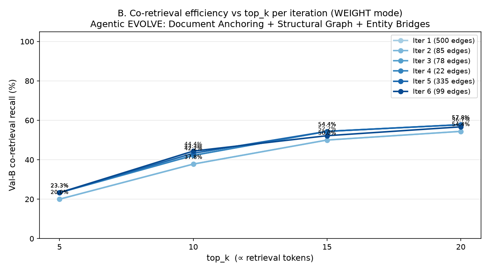

# Scenario 2 — Evolving RAG Benchmark (ver4)

Generated: 2026-07-07 00:38:14  |  Iterations: 6

## EVOLVE Strategy: Agentic RAG (DA + DCSG + CDRB) + WEIGHT Chunk Pick Mode

- **Service evaluation**: top-20 (actual retrieval)
- **EVOLVE analysis**: top-50 (wider observation window)
- **Evidence threshold**: 2+ queries for co-occurrence to qualify
- **Chunk pick mode**: WEIGHT (rank-based, min 1 chunk per entity)

### EVOLVE Architecture
**Strategy 8 — Document Anchoring (DA)**:
Creates DOC:filename entities for ALL documents with source_id = all chunks.
Inserted into entity VDB for direct document-level retrieval.
General: no filename convention or hub/card taxonomy assumed.

**Strategy 9 — Document Co-Structure Graph (DCSG)**:
Adds DOC-level structural edges from query-retrieval co-occurrence patterns.
DOC:file_A ↔ DOC:file_B edges enable document-level multi-hop traversal.

**Strategy 6 — Cross-Document Retrieval Bridge (CDRB)**:
Entity-level complement: specific entity-pair cross-document connections.

## Graphs

## Iteration Results

| Iter | Edges | All@20 | ValA@20 | ValB co@20 | ValB co@10 | ValB co@5 |
|------|-------|--------|---------|------------|------------|-----------|
| 1 | 500 | 99.1% | 99.4% | 54.4% | 37.8% | 20.0% |
| 2 | 85 | 99.1% | 99.4% | 54.4% | 37.8% | 20.0% |
| 3 | 78 | 99.1% | 99.4% | 57.8% | 42.2% | 23.3% |
| 4 | 22 | 99.1% | 99.4% | 57.8% | 42.2% | 23.3% |
| 5 | 335 | 99.1% | 99.4% | 57.8% | 43.3% | 23.3% |
| 6 | 99 | 98.1% | 99.4% | 56.7% | 44.4% | 23.3% |

## Summary
- DA doc-anchors: **572** | DCSG doc-edges: **283** | CDRB entity-edges: **151**
- Total edges injected: **1119**
- Val-B co@20: **54.4% → 56.7% (+2.3%)**