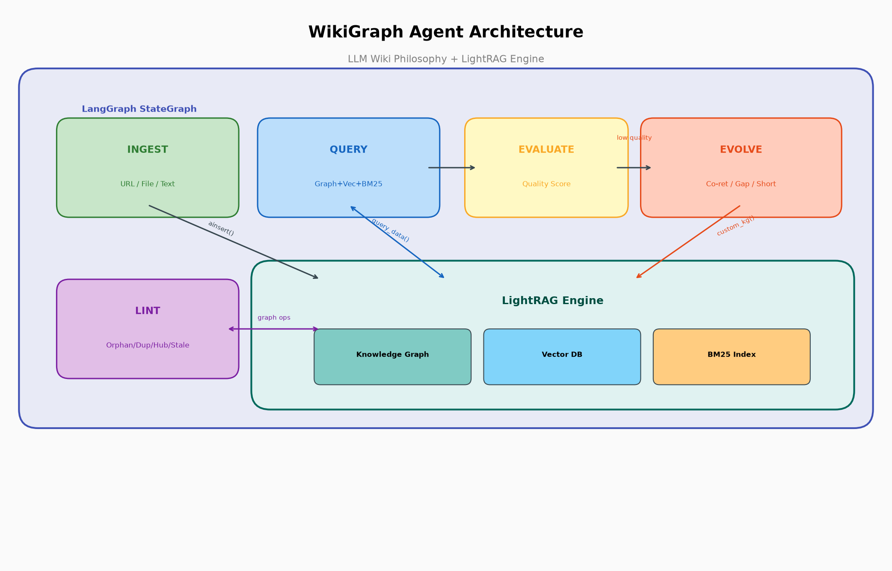
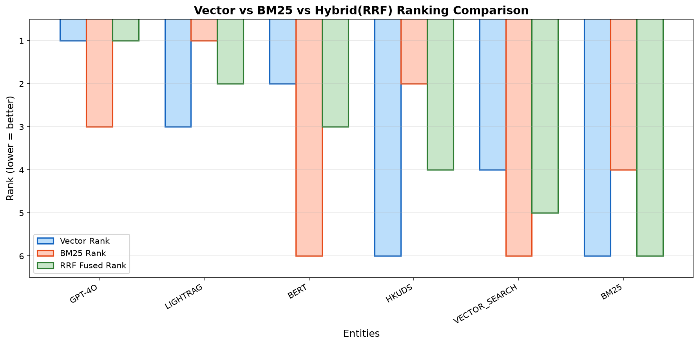

# WikiGraph RAG Agent

> **LLM Wiki의 "지식이 자라는" 철학 + LightRAG의 그래프 검색 엔진**
>
> Karpathy의 LLM Wiki 패턴이 가진 스케일/업데이트 한계를, LightRAG의 증분 그래프 업데이트와 하이브리드 검색으로 해결합니다.



---

## Part 1: LightRAG Hybrid Search (구현 완료)

### 문제: 벡터 전용 검색의 한계


LightRAG의 모든 검색 경로(엔티티, 관계, 청크)가 **벡터 코사인 유사도에만 의존**합니다.

| 쿼리 유형 | 문제 |
|---|---|
| 고유명사 ("GPT-4o", "HKUDS") | 임베딩 근사 매칭으로 정확한 결과 놓침 |
| 짧은 쿼리 (1-2 단어) | 임베딩 품질 급격히 저하 |
| 정확한 키워드 매칭 | 동일 단어 포함 문서를 놓칠 수 있음 |

### 해결: BM25 + Vector + RRF 하이브리드 검색


각 검색 경로에 **BM25 키워드 검색**을 추가하고 **RRF (Reciprocal Rank Fusion)**로 병합:

```
Query ──┬── Vector Search (의미 유사도) ──┐
        │                                 ├── RRF 병합 → 최종 순위
        └── BM25 Search (키워드 매칭)  ──┘
```


```
RRF(d) = SUM 1/(k + rank_r(d)),  k=60
```

양쪽에서 모두 검색된 문서가 더 높은 순위를 받습니다.



### 구현 상세

| 파일 | 변경 |
|---|---|
| `lightrag/bm25_index.py` | BM25Index 클래스 + RRF + 증분 `add()` + 디스크 `save()/load()` |
| `lightrag/lightrag.py` | BM25 빌드/로드, 점진적 업데이트 콜백 |
| `lightrag/operate.py` | 3개 검색 함수에 하이브리드 모드 추가 |
| `lightrag/pipeline.py` | chunks VDB upsert 후 BM25 즉시 업데이트 |

**핵심: 점진적 BM25 인덱싱** — 기존의 전체 재빌드 대신, 각 VDB upsert 시점마다 즉시 업데이트:

```
엔티티 VDB upsert → [BM25 Entities 즉시 add()]
릴레이션 VDB upsert → [BM25 Relations 즉시 add()]
청크 VDB upsert → [BM25 Chunks 즉시 add()]
```

---

## Part 2: LLM Wiki — 철학과 한계

### Karpathy의 LLM Wiki (2026.04)

> "Stop re-deriving, start compiling." — 매번 다시 찾지 말고, 한번 정리해서 축적하라.
>
> — [Andrej Karpathy, GitHub Gist](https://gist.github.com/karpathy/442a6bf555914893e9891c11519de94f)

**3계층 아키텍처**: Raw Sources (불변) → Wiki (LLM이 유지보수) → Schema (구조 규칙)

**3가지 동작**:

| 동작 | 설명 |
|---|---|
| **INGEST** | 새 문서 → LLM이 기존 wiki 10-15개 페이지 업데이트 |
| **QUERY** | wiki에서 검색 → 답변 → 좋은 답변은 wiki에 편입 |
| **LINT** | 주기적 건강검진 — 모순, 고아, 갭 탐지 |

### LLM Wiki의 한계 (v2 포함)

| # | 한계 | 원인 | WikiGraph 해결 |
|---|---|---|---|
| 1 | **오류 전파** | LLM 합성 오류가 영구적 | 원본 청크 보존 → 검증 가능 |
| 2 | **세션 리셋** | 매번 wiki 전체 재로딩 | 그래프 영속 + 즉시 검색 |
| 3 | **스케일 ~1000페이지** | 파일 기반 한계 | 수만 노드 (Neo4j/PG) |
| 4 | **멀티홉 불가** | 페이지 간 순회 어려움 | 그래프 경로 순회 |
| 5 | **관계 의미 부재** | `[[링크]]` = 타입 없음 | 엣지에 타입+가중치+설명 |
| 6 | **품질 저하 무감지** | 탐지 메커니즘 부재 | 그래프 알고리즘 탐지 |
| 7 | **업데이트 비용 높음** | 15페이지 재작성 | 노드/엣지 증분 업데이트 |

Sources: [What LLM Wiki Is Missing](https://dev.to/penfieldlabs/what-karpathys-llm-wiki-is-missing-and-how-to-fix-it-1988), [RAG vs Agent Memory vs LLM Wiki](https://dev.to/vishalmysore/rag-vs-agent-memory-vs-llm-wiki-a-practical-comparison-1oo6)

---

## Part 3: WikiGraph Agent — 아키텍처

### 핵심 아이디어

LLM Wiki의 INGEST → QUERY → EVOLVE → LINT 사이클을, LightRAG의 그래프 엔진 위에서 돌려서 **스케일과 효율성을 동시에 확보**합니다.


### LangGraph 상태 머신

```
                    ┌─────────┐
           ┌───────│ ROUTER  │───────┐
           │       └─────────┘       │
           ▼            │            ▼
      ┌─────────┐  ┌────▼────┐  ┌────────┐
      │ INGEST  │  │  QUERY  │  │  LINT  │
      │ ainsert │  │ aquery  │  │ graph  │
      └────┬────┘  └────┬────┘  │ algos  │
           │            │       └────────┘
           ▼       ┌────▼────┐
        (done)     │EVALUATE │
                   │ quality │
                   └────┬────┘
                        │
              ┌─────────┼─────────┐
              │ quality < 0.5     │ quality >= 0.5
              ▼                   ▼
         ┌─────────┐          (done)
         │ EVOLVE  │
         │custom_kg│
         └────┬────┘
              ▼
           (done)
```

**쿼리는 LangGraph를 통해 실행됩니다.** 사용자가 `agent.query()`를 호출하면:
1. **QUERY**: `rag.aquery_data()` → 엔티티/관계/청크 검색 + 쿼리 로그 기록
2. **EVALUATE**: 결과 품질 점수 계산 (0.0~1.0, LLM 호출 없음)
3. **EVOLVE** (품질 < 0.5일 때): 쿼리 로그 분석 → 새 관계 추론 → `ainsert_custom_kg()`

### 백그라운드 에이전트 동작 흐름

```
┌──── 유저 활동 ─────────────────────────────────────────────────────┐
│                                                                   │
│  query("LightRAG 청킹 전략?")                                     │
│       │                                                           │
│       ▼                                                           │
│  ┌─ QUERY ─────────────────────────────────────────────────┐      │
│  │ 1. rag.aquery_data() → 엔티티 5개, 관계 3개 반환        │      │
│  │ 2. 쿼리 로그에 기록: {query, entities, relations, time}  │      │
│  │ 3. 엔티티 메타데이터 갱신: access_count++, last_accessed │      │
│  └─────────────────────────────────────────────────────────┘      │
│       │                                                           │
│       ▼                                                           │
│  ┌─ EVALUATE ──────────────────────────────────────────────┐      │
│  │ quality = 0.7 (엔티티 5 + 관계 3 → 충분)                │      │
│  │ → EVOLVE 불필요                                         │      │
│  └─────────────────────────────────────────────────────────┘      │
│                                                                   │
│  query("semantic chunking과 vector DB의 관계?")                   │
│       │                                                           │
│       ▼                                                           │
│  ┌─ QUERY ─────────────────────────────────────────────────┐      │
│  │ → 엔티티 0개, 관계 0개 반환 (지식 갭!)                   │      │
│  └─────────────────────────────────────────────────────────┘      │
│       │                                                           │
│       ▼                                                           │
│  ┌─ EVALUATE ──────────────────────────────────────────────┐      │
│  │ quality = 0.0 → EVOLVE 트리거!                          │      │
│  └─────────────────────────────────────────────────────────┘      │
│       │                                                           │
│       ▼                                                           │
│  ┌─ EVOLVE (백그라운드) ───────────────────────────────────┐      │
│  │                                                         │      │
│  │  Strategy 1: 쿼리 로그에서 "CHUNKING"+"EMBEDDING"이     │      │
│  │  3회 공동 검색됨 → 직접 관계 없음 →                     │      │
│  │  LLM: "청킹은 임베딩의 입력 단위를 결정한다"             │      │
│  │  → ainsert_custom_kg({relationships: [...]})            │      │
│  │                                                         │      │
│  │  Strategy 2: 실패 쿼리 분석 →                           │      │
│  │  LLM: "SEMANTIC_CHUNKING 엔티티와 VECTOR_DB 관계 제안"  │      │
│  │  → ainsert_custom_kg({entities: [...], relationships:}) │      │
│  │                                                         │      │
│  │  [그래프에 새 노드 2개 + 엣지 3개 추가됨]               │      │
│  │  [BM25 인덱스 자동 갱신됨]                              │      │
│  └─────────────────────────────────────────────────────────┘      │
│                                                                   │
│  같은 query 재실행 → 이제 결과가 나옴! (quality 0.0 → 0.7)       │
│                                                                   │
├──── 주기적 LINT ──────────────────────────────────────────────────┤
│                                                                   │
│  ┌─ LINT (graph 알고리즘, 0 토큰) ─────────────────────────┐      │
│  │ CHECK 1: node_degree()==0 → 고아 노드 3개 발견          │      │
│  │ CHECK 2: node_degree()>50 → 허브 과부하 0개             │      │
│  │ CHECK 3: 임베딩 유사도>0.95 → 중복 "BUN"/"BUNJS" 발견   │      │
│  │ CHECK 4: access_count<2 → 방치 엔티티 5개               │      │
│  │ CHECK 5: 다중 description → 모순 후보 1개               │      │
│  └─────────────────────────────────────────────────────────┘      │
│                                                                   │
└───────────────────────────────────────────────────────────────────┘
```

### EVOLVE — 3가지 진화 전략


| 전략 | 트리거 | 동작 | LightRAG API |
|---|---|---|---|
| **Co-retrieval** | 엔티티 A,B가 3회+ 함께 검색 | LLM으로 관계 추론 → 새 엣지 생성 | `ainsert_custom_kg()` |
| **Gap Fill** | 쿼리 quality < 0.3 | LLM에게 부족한 엔티티/관계 제안 요청 | `ainsert_custom_kg()` |
| **Shortcut** | A→B→C 경로 3회+ 사용 | A→C 직접 관계 자동 생성 | `ainsert_custom_kg()` |

모든 진화된 지식은 `source_id="wikigraph_evolve"`로 마킹되어 **원본 추출 vs 추론 지식 구분 가능**.

### LINT — 그래프 건강검진 (0 토큰)

LLM Wiki는 전체 wiki를 LLM으로 스캔(수만 토큰). WikiGraph는 **그래프 알고리즘**으로 비용 0:

| 검사 | 알고리즘 | 비용 |
|---|---|---|
| 고아 노드 | `node_degree() == 0` | 0 tokens |
| 허브 과부하 | `node_degree() > 50` | 0 tokens |
| 중복 엔티티 | 임베딩 유사도 > 0.95 | embedding only |
| 방치 엔티티 | 쿼리 로그 미접근 | 0 tokens |
| 모순 탐지 | 다중 description 비교 | optional LLM |

### INGEST — 쉬운 문서 추가

| 소스 | 방식 |
|---|---|
| 파일/디렉토리 | `sources.collect_files()` → 자동 수집 |
| 변경 감지 | `sources.detect_changed_files()` → content hash 비교, 변경분만 재처리 |
| 텍스트 | `agent.ingest(["기억할 내용"])` → 즉시 그래프에 추가 |

LightRAG의 **증분 업데이트** 덕분에 기존 그래프 재구축 불필요.

---

## Part 4: 비교 분석


### 상세 비교

| 차원 | Traditional RAG | LLM Wiki v2 | **WikiGraph Agent** |
|---|---|---|---|
| **지식 표현** | 벡터 청크 | 마크다운 페이지 | 그래프 노드/엣지 |
| **지식 진화** | ❌ 정적 | ✅ 페이지 재작성 | ✅ 증분 업데이트 |
| **스케일** | ✅ 수백만 문서 | ❌ ~1000페이지 | ✅ 수만 노드 |
| **멀티홉 추론** | ❌ | ❌ | ✅ 그래프 순회 |
| **오류 검증** | ✅ 원본 재참조 | ❌ 오류 전파 | ✅ 원본 보존 |
| **업데이트 비용** | 낮음 | 높음 (15페이지) | **최소 (증분)** |
| **검색** | 벡터만 | 하이브리드 | 벡터+BM25+그래프 |
| **건강검진** | ❌ | LLM 스캔 | **그래프 알고리즘** |
| **토큰 비용/쿼리** | ~3K | ~10K | **~2K** |

### 토큰 비용 예상 (문서 100개 기준)

| 시나리오 | LLM Wiki v2 | WikiGraph Agent | 절감 |
|---|---|---|---|
| INGEST 1건 | ~50K tokens | ~5K tokens | **90%** |
| QUERY 1건 | ~10K tokens | ~2K tokens | **80%** |
| LINT | ~100K tokens | 0 tokens | **100%** |
| 100 QUERY 총비용 | ~1M tokens | ~200K tokens | **80%** |

---

## 기술 스택

| 컴포넌트 | 기술 |
|---|---|
| Agent 오케스트레이션 | **LangGraph** StateGraph |
| 지식 엔진 | **LightRAG** (Graph + VDB + BM25) |
| 임베딩 | sentence-transformers/all-MiniLM-L6-v2 (로컬 CPU) |
| LLM | Qwen 35B (원격 서버) |
| 검색 | Vector + BM25 + Graph Traversal + RRF |
| 메타데이터 | JSON 파일 (쿼리 로그 + 엔티티 메타) |

---

## 구현 현황

| 컴포넌트 | 상태 |
|---|---|
| BM25 하이브리드 검색 | ✅ 구현 완료 |
| 점진적 BM25 인덱싱 | ✅ 구현 완료 |
| BM25 디스크 영속화 | ✅ 구현 완료 |
| WikiGraph INGEST | ✅ 구현 완료 |
| WikiGraph QUERY + EVALUATE | ✅ 구현 완료 |
| WikiGraph EVOLVE (3전략) | ✅ 구현 완료 |
| WikiGraph LINT (5검사) | ✅ 구현 완료 |
| LangGraph 상태 머신 | ✅ 구현 완료 |
| 메타데이터 영속화 | ✅ 구현 완료 |
| 파일 변경 감지 소스 수집 | ✅ 구현 완료 |
| Confidence Decay | 📋 향후 |
| URL 크롤링 | 📋 향후 |

---

## 향후 방향

1. **자동 소스 수집** — RSS, API 연동으로 지식 자동 성장
2. **Confidence Decay** — 시간에 따른 지식 신뢰도 감쇠
3. **커뮤니티 기반 요약** — 그래프 클러스터 자동 요약 노드 생성
4. **멀티 에이전트** — 도메인별 전문 에이전트 협업
5. **실시간 모순 탐지** — ingest 시점에 기존 그래프와 충돌 검사

---

## 결론

```
LLM Wiki:   지식은 자라야 한다   + 스케일 한계 + 높은 토큰 비용
LightRAG:   효율적인 그래프 검색  + 정적 지식
                        ↓
WikiGraph Agent:  스케일러블하게 자라는 지식 그래프
                  + 쿼리 패턴 기반 자동 진화
                  + 0-토큰 건강검진
                  + 증분 업데이트로 최소 비용
```

---

## References

- [Karpathy's LLM Wiki Gist](https://gist.github.com/karpathy/442a6bf555914893e9891c11519de94f) (2026.04)
- [LLM Wiki v2 Extension](https://gist.github.com/rohitg00/2067ab416f7bbe447c1977edaaa681e2)
- [LightRAG Paper](https://arxiv.org/abs/2410.05779) (HKUDS, 2024)
- [What Karpathy's LLM Wiki Is Missing](https://dev.to/penfieldlabs/what-karpathys-llm-wiki-is-missing-and-how-to-fix-it-1988)
- [RAG vs Agent Memory vs LLM Wiki](https://dev.to/vishalmysore/rag-vs-agent-memory-vs-llm-wiki-a-practical-comparison-1oo6)
- [Did LLM Wiki Kill RAG?](https://www.epsilla.com/blogs/llm-wiki-kills-rag-karpathy-enterprise-semantic-graph)
